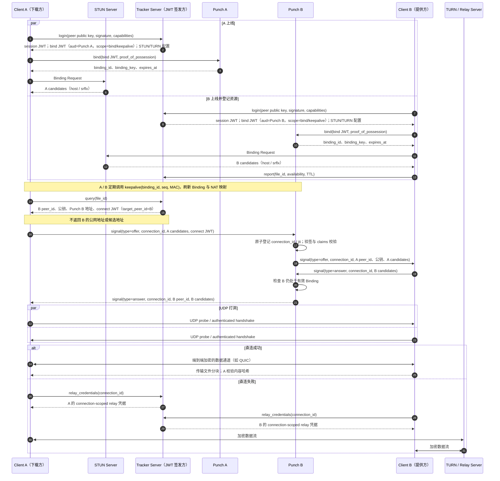

# P2P 连接流程与授权设计

本文统一使用以下名称：

- **Tracker Server**：身份认证、资源索引、Peer 发现与 JWT 签发。
- **Punch Server**：维护 Peer 的在线 Binding，转发打洞信令。
- **STUN Server**：协助客户端收集公网候选地址。
- **TURN / Relay Server**：无法直连时转发数据流。

`peer_id` 应由客户端长期保存的公钥派生，而非由 Tracker 临时分配。客户端分别登录并绑定到各自的 Punch Server；一次下载连接中，A 会直接联系 B 所在的 Punch Server。

## 完整流程



## 各步骤说明与设计原因

### 1. 登录与身份建立

客户端携带公钥及对挑战或请求的签名登录 Tracker。Tracker 验证身份后，返回本次会话可使用的 JWT、分配的 Punch Server 地址，以及 STUN/TURN 配置。

这样设计的目的，是让 `peer_id` 保持长期稳定，同时让短期访问权可过期、可轮换。Tracker 不是文件数据的中转站，而是身份、发现与授权控制面。

### 2. `bind` 与 `keepalive`

客户端使用仅面向自身 Punch Server 的 `bind` JWT 建立 Binding，并使用 `peer_id` 对应私钥对本次请求的 nonce、`punch_id`、时间戳签名，证明令牌持有者确实控制该身份。单独的 bearer JWT 不能作为 bind 的唯一凭据。Punch Server 验签并验证该证明后创建 `binding_id`，并通过受 TLS 保护的已认证响应返回随机生成的会话级 `binding_key`。此 Binding 代表“该 peer 当前可通过这个 Punch Server 被联系到”。

之后的保活使用 `keepalive(binding_id, seq, MAC)`，而不是每次发送完整 JWT。MAC 固定为 `HMAC-SHA-256(binding_key, binding_id || seq || timestamp || transport_generation)`；服务端仅接受递增序列号（允许一个有限乱序窗口）且 timestamp 在短窗口内的请求。Binding 到期、客户端重新 bind、或网络切换时，旧 `binding_key` 和旧序列号空间立即失效。这样既刷新 NAT 映射和在线 TTL，也避免频繁验签与较大的 UDP 包。

### 3. STUN 收集候选地址

客户端自行向 STUN Server 收集候选地址，例如局域网地址（host candidate）与公网映射地址（server-reflexive candidate）。STUN Binding、连通性检查和最终 QUIC/UDP 数据通道必须复用同一 UDP socket；否则 NAT 映射端口可能改变，已交换的 srflx candidate 不可用。

Tracker 不保存或下发这些地址：候选地址会随网络切换而变化，且提前暴露会扩大隐私泄露与扫描风险。候选地址只在获得连接授权后的 Punch 信令中交换。每个 candidate 必须包含协议、IP/端口、类型、优先级和 `transport_generation`；generation 变化后旧 candidate 不得使用。默认不对非同一私网的 Peer 发送 host candidate，以避免泄露内网拓扑；允许发送时应使用 mDNS 名称或由用户显式选择。

### 4. 资源登记与查询

B 使用 `report(file_id, availability, TTL)` 登记自己可提供的资源；记录必须带 TTL（服务端设置最大值），离线后自动失效。A 使用 `query(file_id)` 查询少量候选 Peer。`file_id` 固定为规范化 manifest 的 SHA-256 摘要；manifest 定义文件长度、分块大小、每块 SHA-256 和 Merkle 根。`availability` 使用 manifest 中的块索引集合，完整文件使用 `complete=true`，不能使用调用方自定义的文件名或非规范哈希作为资源标识。

Tracker 的查询结果仅包含 B 的 `peer_id`、B 的身份公钥、B 所在 Punch Server 地址和一次连接所需的 `connect` JWT；**不包含 B 的公网地址或候选地址**。限制候选数量、对 query/report 按身份和资源施加速率限制，并限制单个资源的返回分页，能避免热门资源的索引放大和完整 Peer 列表泄露。

### 5. 通过 Punch B 交换候选地址

A 生成随机、不可预测的 `connection_id`，并通过 `punch.signal` 发送 `type=offer`，其中包含自己的候选地址与 `connect` JWT。Punch B 验证 `aud`、`scope`、`sub`、`target_peer_id`、`exp` 和 `jti` 后，原子创建 `(jti, connection_id)` 记录，再向 B 转发该 offer。B 再通过同一个 `punch.signal` 接口发送 `type=answer`，携带最新的 `B candidates` 与 `connection_id`；Punch B 仅在该记录仍有效且 B 处于有效 Binding 时将其转发给 A。

`jti` 的有效期内，同一 `connection_id`、相同 offer 的重传必须幂等，并返回已有处理结果；不同 `connection_id` 或不同内容复用该 `jti` 必须拒绝。若在连接建立超时前未收到 answer，A 应使用新的 `connect` JWT 发起新连接。`cancel` 会使 Punch B 删除该连接记录并停止转发；两端都应在固定连接超时后清理记录。离线、令牌过期、目标拒绝、限流应返回可区分的错误码，但对未授权请求不泄露目标是否在线。

`offer`、`answer`、`candidate` 和 `cancel` 都是 `punch.signal` 的消息类型，而不是独立接口。若支持 ICE trickle，后续新增候选地址也使用 `type=candidate` 和同一个 `connection_id`。

因此，A 直接请求 **Punch B**，而不是先经由 Punch A 再转发。Punch A 的职责仅是维护 A 自己的在线 Binding；Punch B 则因为持有 B 的有效 Binding，能够把信令送达 B。

### 6. 同时 UDP 打洞与直连

拿到彼此候选地址后，A 与 B 同时向对方发送 UDP 探测包并进行端到端身份认证握手。两端同时发包能帮助各自 NAT 建立允许回包的映射。实现采用 QUIC/TLS 1.3（或等价的 Noise 模式）：双方在握手中用长期私钥签名，并将 `connection_id`、双方 `peer_id`、双方身份公钥和 `file_id` 绑定进 transcript。A 必须校验握手中的 B 公钥能派生出 Tracker 返回的 B `peer_id`；B 对 A 作相同校验。握手失败、未在截止时间内完成或 candidate generation 变化时，放弃本轮候选地址并按前述重试规则处理。

直连成功后，文件分块走端到端加密通道，Punch Server 不参与文件传输。接收方按 manifest 校验每个分块哈希和最终 Merkle 根；不匹配的分块不得写入已验证状态，并应记录该 Peer 的失败计数。

### 7. TURN 回退

对称 NAT、企业防火墙或 CGNAT 等环境可能导致打洞失败。这时双方以 `connection_id` 请求面向同一连接的独立中继授权，然后经 TURN 传输加密数据。每个授权必须包含 `connection_id`、`sub`、对端 `peer_id`、`aud`、过期时间、最大分配时长、带宽和并发配额；TURN 或其前置授权网关必须只允许该连接的配对端点。若所选标准 TURN 实现无法约束 peer 地址，则不得声称凭据本身能阻止其被当作代理，必须由前置网关实施该策略。

TURN 只转发密文流量，不能成为内容可信边界。若使用标准 coturn，通常由 Tracker 根据同一套授权决策换发短期 TURN REST 凭据；若 TURN 支持 JWT 鉴权，则可以直接使用 `relay` JWT。

## JWT 的统一模型

所有授权票据可使用同一种 JWT 格式与同一套 Tracker 签名密钥体系，但必须签发为不同、最小权限的 JWT 实例。

| JWT 用途 | `aud` | `scope` | 关键附加 claims | 典型有效期 |
|---|---|---|---|---|
| Tracker API 会话 | `tracker` | `query`、`report` | `sub` | 分钟级至小时级 |
| 建立/刷新 Punch Binding | 指定 `punch_id` | `bind`、`keepalive` | `sub` | 10–30 分钟 |
| 请求连接目标 Peer | 指定 `punch_b_id` | `connect` | `sub`、`target_peer_id`、`file_id`、`jti` | 数十秒 |
| 使用 TURN 中继 | 指定 `turn_region_id` | `relay` | `connection_id`、对端 `peer_id`、带宽/连接数/时长配额 | 分钟级 |

每个服务应至少校验：签名算法和签名、`iss`、`kid`、`aud`、`scope`、`sub`、`nbf`/`exp`；对于 `connect` JWT，还应校验 `target_peer_id`、`file_id` 与一次性 `jti` 的幂等消费语义。

## 接口契约与运行边界

Tracker API 与 `punch.bind` / `punch.signal` 的请求响应控制面经 TLS 传输；为维持 NAT 映射的 `punch.keepalive` 可使用 UDP，但必须遵循前述 MAC、时钟窗口和序列号校验。消息使用版本化 schema；未知必填字段、超出大小限制的 candidate 列表和不匹配的 `connection_id` 都必须拒绝。每个响应至少带协议版本、请求 ID 和明确的错误码。下表定义实现必须达成的最小契约；字段的具体编码可由后续 API 文档确定。

| 接口 | 请求中的关键字段 | 成功响应 / 幂等规则 | 授权与限制 |
|---|---|---|---|
| `tracker.login` | 公钥、挑战签名、capabilities | session、bind JWT、服务配置 | 验证签名；对挑战一次性消费 |
| `tracker.report` | `file_id`、manifest 引用、availability、TTL | 服务端裁剪后的过期时间；同一 peer/file 覆盖更新 | session `report`；限制 TTL、资源数和频率 |
| `tracker.query` | `file_id`、候选数 | 有上限的候选页及每个目标的 connect JWT | session `query`；限流、防枚举、不得返回 candidates |
| `tracker.relay_credentials` | `connection_id` | 当前连接的一对 relay 凭据 | 仅连接双方；检查 connect 记录与配额 |
| `punch.bind` | bind JWT、持钥证明 | `binding_id`、`binding_key`、过期时间 | JWT + 持钥证明；新 binding 替换旧 binding |
| `punch.keepalive` | `binding_id`、seq、timestamp、MAC | 刷新后的过期时间 | 有效 binding；校验 MAC、时钟窗口和序列窗口 |
| `punch.signal` | type、`connection_id`、候选或控制字段 | type 对应的转发确认/错误 | offer 验证 connect JWT；answer/candidate/cancel 仅接受已登记连接的双方 |

### 没有这些 JWT / 授权机制会怎样

- 没有面向 Punch 的 `bind` JWT：攻击者可伪造任意 `peer_id` 绑定到 Punch Server，造成身份冒充、在线表污染或会话劫持。
- 没有 `keepalive` 的 MAC、序列号和过期管理：攻击者可伪造或重放保活包，使虚假 Binding 长期存在，或干扰真实 Peer 的可达性。
- 没有针对 B 的短期 `connect` JWT：任何人只要知道 Punch B 地址，就能要求它向 B 投递信令；Punch Server 会被用于骚扰、扫描、反射流量或对大量 Peer 发起连接请求。
- 只靠 `scope=connect`、却不校验 `aud` 与 `target_peer_id`：一张泄露票据可被拿去联系其他 Punch 节点或其他 Peer，权限范围过大。
- 没有 `exp`、`jti`：截获的连接请求可在很久以后无限重放。
- 没有独立的 TURN 授权与配额：攻击者可把 TURN 当开放代理消耗带宽，造成高额成本与滥用风险。
- 没有端到端身份认证和加密：即便 Punch/TURN 已正确鉴权，仍无法阻止恶意中继或网络路径窥探、篡改、冒充对端。

## 建议的接口命名

```text
tracker.login
tracker.report
tracker.query
tracker.relay_credentials

punch.bind
punch.keepalive
punch.signal
```
