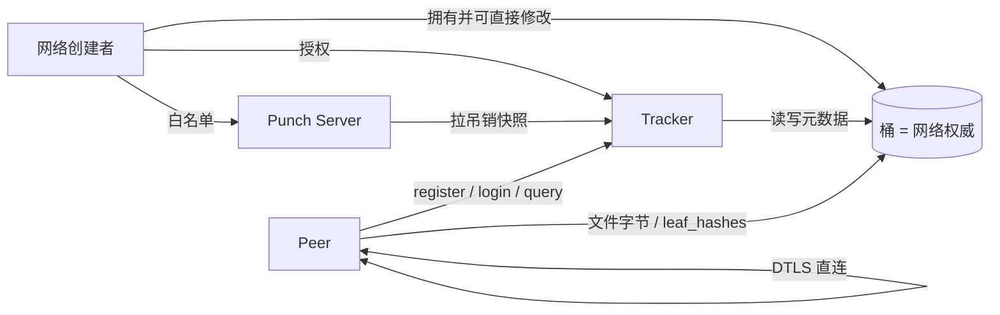
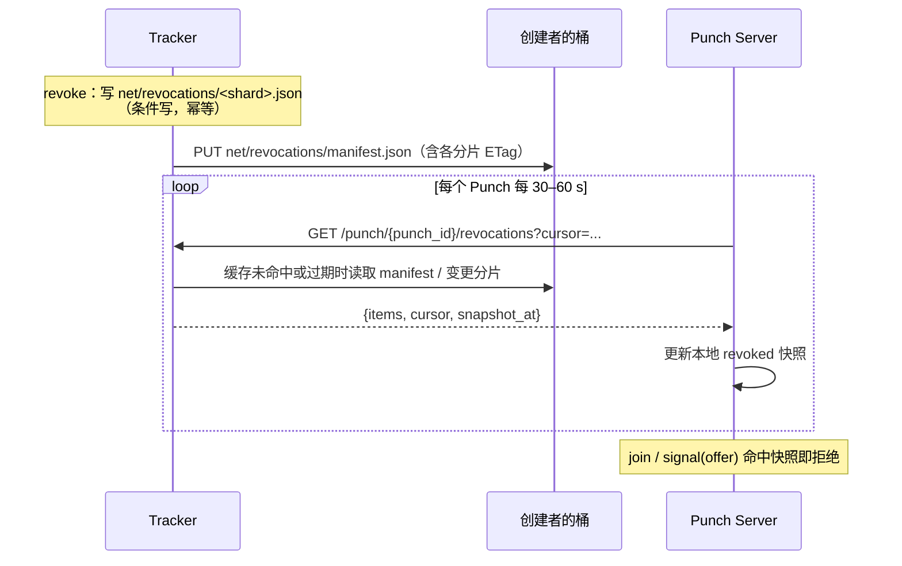

# 自建 P2P 网络设计（Self-hosted Network）

| 状态 | 最后更新 |
| --- | --- |
| 提案（RFC，未定案） | 2026-09-21 |

> **本文的定位**：本文是 `p2p-technical.md`（下称"既有设计"）的一次**定位级改版提案**，不是补丁。第 9 章另外给出服务形态与计费边界（开源实现 + 托管 PaaS，我们不托管网络的数据）。2026-09-21 补入桶凭据的授予与撤销机制（3.6 节），并据此把安全边界从"路径前缀"改为"桶"（2.1 节）——推荐一网络一桶。既有设计隐含"由单一运营方提供一张全局 P2P 网络"的假设——Tracker 是信任根、状态存在 Tracker 自己手里、运营方承担带宽与中继成本。本文把假设换成：**任何人都可以创建一个 P2P 网络，网络的权威状态存放在创建者自己的对象存储（桶）里**。
>
> 数据面（ICE / DTLS / WebRTC DataChannel、block / piece / chunk、Merkle 证明、调度）几乎不变，本文只做摘要并指向既有设计；**变化集中在控制面与信任模型**。第 9 章给出服务形态与计费边界，第 11 章给出 v2 → v3 的完整差异清单，第 12 章列出尚未定案的问题。

## 1. 引言

### 1.1 动机

既有设计解决了"两个 Peer 如何安全地交换数据"，但它的部署模型是单租户的：一个 Tracker 集群、一份身份注册表、一张资源索引、一个运营方。这带来三个绕不开的问题：

1. **运营方承担全部基础设施成本**——状态存储、Tracker 计算、TURN 中继带宽都由运营方付钱，而带宽成本正是产品想摊给用户的东西。
2. **计量缺乏可信基准**——SDK 嵌在客户 App 内、客户是计费对象，`min(上报)` 这类交叉校验防不住两端合谋少报（见 issue #9）。
3. **元数据集中在运营方**——谁在分享什么、谁在线，全部由运营方持有。这既是合规负担，也让"自建社区"这类场景无法成立。

把网络的所有权交还给创建者，三者同时得到解决：**状态与带宽落在创建者自己的桶上**，而桶的出向流量由云厂商计量——一个外部、不可篡改、per-network 的计费基准。

### 1.2 与既有设计的关系

| 维度 | 既有设计（v2） | 本文（v3） |
| --- | --- | --- |
| 网络规模假设 | 单张全局网络 | 任意多张网络，各自独立 |
| 权威状态存放 | Tracker 的共享存储 | 创建者的对象存储桶 |
| 信任根 | Tracker Server | 网络创建者（桶），Tracker 是被授权签发者 |
| Tracker 状态 | 有持久状态，多实例需共享存储 | 无持久业务状态，多实例无需共享存储 |
| 吊销范围 | 全局 | 网络级 |
| 计量基准 | 遥测交叉校验 / 第三方 CDN 账单降幅 | 桶出向流量（云厂商账单）+ A/B 对照 |
| Punch 提供者 | 运营方 | 运营方公共池，或创建者自建 |
| 服务形态 | 运营方提供一张网络 | 开源实现 + 托管 PaaS，组件可混合自建、按组件计费（第 9 章） |
| 数据面 | Merkle + chunk + 双 DataChannel | **不变** |

### 1.3 规范性语言

本文按 RFC 2119 / RFC 8174 的语义使用 **必须**（MUST）、**不得**（MUST NOT）、**应当**（SHOULD）、**可以**（MAY）。

### 1.4 角色与术语（新增与变更）

沿用既有设计的 `peer_id`、block / piece / chunk、Binding 等术语，新增：

- **网络创建者（Network Creator）**：创建一个网络的人。他提供桶、决定授权哪些 Tracker 与 Punch、对**自己网络内**的元数据拥有完全控制权。他不是全局管理员——他的权力只覆盖自己的网络。
- **网络（Network）**：由 `network_id` 标识的一个命名空间。同一个 `peer_id` 可以加入任意多个网络，彼此独立。
- **桶（Bucket）**：网络的权威存储，S3 兼容对象存储（AWS S3、Cloudflare R2、MinIO、腾讯云 COS 等均可）。既存资源字节（CDN 源），也存网络元数据。
- **网络描述符（Descriptor）**：桶里的一份文档，描述网络的名字、授权的 Tracker 公钥集合、Punch 白名单等。

角色关系：



## 2. 网络模型

### 2.1 网络的定义

一个网络由它的桶唯一确定。**`network_id` 就是规范化后的桶 URI**：

```
network_id = "s3://my-bucket"
```

这样定义的好处是它自解释、无需额外哈希、客户端拿到就能定位权威状态；代价是**换桶等于换网络**（需要重新分发种子），这是可接受的——换存储位置本来就是重建网络级别的操作。

**安全边界是桶，不是路径前缀。** 桶内的 `net/` 与 `files/` 只是固定的对象布局，不承担隔离职责。原因是并非所有 S3 兼容存储都支持前缀级策略：AWS S3 / MinIO / 腾讯云 COS 可以，但 Cloudflare R2 的 API token 粒度是**桶级**（读 / 写 / 列表），没有前缀条件。因此：

- 推荐形态是**一网络一桶**——桶即权限边界，在任何兼容存储上都能得到一致的隔离强度；
- 若在同一桶内用不同前缀承载多个网络（`network_id = "s3://my-bucket/net/demo"`），则**必须**在存储侧用策略强制该前缀，否则这些网络之间不存在任何隔离保证。这只应在确认目标存储支持前缀级策略时使用，且**不得**在文档中把它当作默认形态。

桶里必须存在一份网络描述符 `net/descriptor.json`：

```text
{
  v: 1
  network_id: "s3://my-bucket"
  name: "...", description: "..."        展示用
  created_at: <unix seconds>
  seq: <u64>                             单调递增，防回滚（见 3.6.4 节）
  creator_public_key: <32B>              创建者公钥，用于验签本文件与 trackers.json
  signature: <64B>                       sign(creator_key, canonical(本文件除 signature 外))
}
```

描述符是**网络的根信任锚**：客户端首次加入一个网络时下载它、校验创建者签名，之后把 `creator_public_key` 作为该网络一切元数据变更的验证依据。

### 2.2 信任根的迁移

这是本文最重要的一处语义变化。既有设计 §8 写"Tracker 是控制面的信任根"；本文改为：

> **网络创建者是信任根。Tracker 只是被创建者授权的签发者与门房。**

具体含义：

| 能力 | 归属 |
| --- | --- |
| 决定谁能当 Tracker | 创建者（`net/trackers.json`） |
| 决定谁能当 Punch | 创建者（`net/punches.json`） |
| 吊销某个 peer | 创建者（直接改桶）或 Tracker（代写） |
| 签发票据 | Tracker（用 `net/trackers.json` 里的密钥） |
| 撤销某个 Tracker | 创建者（从 `net/trackers.json` 移除 + 撤销其桶授权，见 3.6 节） |

后果是**Tracker 作恶的破坏半径变小了**：它不能篡改创建者未授权给它写的对象（见 3.5 节的权限矩阵与 3.6 节的强制方式），也不能阻止创建者把它踢掉。这是 self-hosted 模型相对单租户模型最实质的安全收益。

### 2.3 客户端如何加入一个网络

种子文件与磁力链不变（既有设计 §5），只是 `tracker_list` 与 `cdn_list` 的语义具体化：

```text
种子文件 = bencode({
  tracker_list: ["https://t1.example.com", "https://t2.example.com"]   该网络的 Tracker，可多个
  cdn_list:     ["https://my-bucket.s3.amazonaws.com/net/demo/files/x.iso"]
  proof_list:   ["https://my-bucket.s3.amazonaws.com/net/demo/files/x.iso.hashes"]
  leaf_hashes:  <bytes>                                    可选，内联叶子哈希列表
  info: { v: 2, name, length, block_size, piece_size, mime, root }
})
```

`cdn_list` 与 `proof_list` 默认指向桶——这是本模型与既有设计的自然契合点：创建者把文件放进桶，桶同时就是冷启动的 CDN 源与证明源，全网零 seeder 也能工作（既有设计 §5.1 的 `proof_list` 硬约束在此变成默认形态）。

一个 `info_hash` 在多个网络中是相同的（它只是内容的哈希），因此**同一份内容可以在不同网络间被发现**——跨网络互通是未来可做的能力，本文不定义。

### 2.4 网络生命周期

| 阶段 | 动作 |
| --- | --- |
| 创建 | 创建者建桶、写 `net/descriptor.json`、放文件与叶子哈希列表、向 Tracker 与 Punch 授权 |
| 运营 | 创建者增删 Tracker / Punch、查看统计、封禁 peer（写吊销分片） |
| 迁移 | 换桶 = 新 `network_id`，需重新分发种子；旧网络可保留只读一段时间 |
| 消亡 | 创建者删除桶即可；客户端表现为"网络不可用"，**应当**给出明确错误而非静默重试 |

## 3. 桶：布局与一致性

### 3.1 对象布局

```text
net/descriptor.json                          网络描述符（创建者签名，根信任锚）
net/trackers.json                            授权 Tracker 公钥集合（JWKS，创建者签名）
net/punches.json                             Punch 公钥白名单（创建者签名）
net/punches/state/<punch_id>.json            Punch 运行时注册（Tracker 写，含地址/容量/load）
net/revocations/manifest.json                吊销分片清单 + 各分片 ETag
net/revocations/<shard>.json                 吊销记录（按 SHA-256(public_key) 首字节分片）
net/peers/<peer_id>.json                     身份注册（含 public_key、expires_at）
net/resources/<info_hash>/<peer_id>.json     资源声明（complete、expires_at）
files/<hh>/<info_hash>                       文件字节（CDN 源）
files/<hh>/<info_hash>.hashes                叶子哈希列表（proof_list 目标）
```

`<hh>` 为 `info_hash` 前两个十六进制字符，用于打散前缀、避免单前缀热点。

### 3.2 读写频率分层

桶适合"低频、大、权威、可缓存"的数据。**决定成败的设计约束是：不要把高频写放进桶。**

| 数据 | 频率 | 放哪 | 理由 |
| --- | --- | --- | --- |
| 文件字节、`*.hashes` | 写一次，读很多 | 桶 | 天然 CDN 缓存 |
| `descriptor` / `trackers` / `punches` | 极低频写，高频读 | 桶 + CDN | 创建者控制面 |
| 吊销记录 | 极低频写，高频读 | 桶 + Tracker 缓存 | Punch 经 Tracker 拉快照 |
| 身份注册 | 每 peer 每 90 天写一次，login 时读 | 桶 | 低频 |
| 资源声明 | 每 peer 每 TTL 写一次 | 桶 | **TTL 必须足够长**，见 3.4 |
| Punch 注册状态 | 每 Punch 每 30–60 s 上报 | 桶（由 Tracker 代写，数量极少） | Punch 数量是十到百量级；Punch 自身不碰桶 |
| Binding / 在线状态 | 每 peer 每 10–30 min 刷新 | **Punch 内存** | 绝不能进桶 |
| `jti` 一次性消费 | 每次连接 | **Punch 内存** | `aud` 已绑定单实例 |
| login nonce | 每次 login | **无状态**（见 4.4） | 不做存储 |
| 限流计数 | 每请求 | **Tracker 内存**（可丢失） | 见 7.3 |

### 3.3 一致性、并发与原子性

现代对象存储对 PUT / GET / LIST 都是写后读一致（S3 自 2020 年起，R2、MinIO 等同样），因此"Tracker 写完 Punch 立刻能读到"成立。仍需注意：

1. **没有事务**。跨对象的原子性不存在，只能靠对象拆分规避。
2. **覆盖是 last-writer-wins**。因此**资源索引必须拆成"每 peer 一对象"**——若做成单对象并发追加，两个 peer 同时 announce 会互相覆盖。
3. **条件写可用**：`If-None-Match: *` 可实现"不存在才写"（原子创建），`If-Match: <ETag>` 可实现乐观锁。这两者足以实现吊销记录的幂等写入。
4. **LIST 分页**：`net/resources/<info_hash>/` 下可能有数万个对象，query **必须**分页（每次 1000 key）并**应当**在 Tracker 侧做短 TTL 缓存。
5. **无监听机制**（对象存储没有 watch），Tracker **应当**轮询或按请求刷新桶对象；Punch 不直接访问桶，而是轮询 Tracker 的吊销快照接口（5.5 节）。

### 3.4 成本与容量约束

对象存储按请求计费（GET 约 $0.4/百万，PUT/LIST 约 $5/百万），量级比数据库贵、比带宽便宜。控制成本的三条硬约束：

1. **资源声明的 TTL 不得过短**。既有设计的 `ttl: 1800`（30 分钟）在桶模型下会产生显著写放大（1 万 peer 即 33 次写/秒，约 $430/月 的 PUT 费用）。本文建议 TTL **不低于 3 小时**，因为"是否在线"本就由 Punch 的 Binding 决定——**资源索引只表达"声明持有"，不表达"在线"**，失效的候选在 `signal` 阶段会被自然过滤掉。
2. **Tracker 侧缓存索引 LIST 结果**（30–60 s），把 LIST 放大压到常数级。
3. **Tracker 缓存吊销列表、描述符与 Punch 清单**，把高频读取压到常数级；Punch 经 Tracker 取吊销快照，不直接读取桶（5.5 节）。

若网络规模大到这些约束不够用，应当引入一层缓存服务（Redis / 内存索引），但那属于优化；本文要求的是**默认配置下不触发**。

### 3.5 桶凭据与最小权限

凭据只发给服务端组件，**客户端永不得持有桶写凭据**。

| 主体 | 权限 | 范围 |
| --- | --- | --- |
| 网络创建者 | 读写全部 | 整个桶 |
| Tracker | **读写** | `net/peers/*`、`net/resources/*`、`net/revocations/*`、`net/punches/state/*` |
| Tracker | **不得** | `net/descriptor.json`、`net/trackers.json`、`net/punches.json` |
| Punch | **无桶凭据** | 不直接访问桶；只经 Tracker API 拉取吊销快照 |
| 客户端 | 只读（公开桶或预签名 URL） | `files/*` |

Tracker 不能改写"谁有权签发"这件事，是 2.2 节"Tracker 作恶破坏半径变小"的技术保证。授予与撤销的具体机制见 3.6 节。

### 3.6 凭据的授予与撤销

权限矩阵只是意图，需要存储侧机制把它变成强制约束。本节以 AWS S3 为基准描述，其他兼容存储按同等能力对齐（差异见 3.6.3 节）。

#### 3.6.1 授予：一网络一桶 + 桶级凭据（推荐形态）

**推荐形态是每个网络独占一个桶，Tracker 持有该桶的读写凭据。** 先说清楚为什么不为 Tracker 做桶内最小权限：

Tracker **本来就已经持有该网络的签名密钥**（4.3 节的 `kid` 私钥），凭它可以签发任意票据、冒充任意 peer。相比之下，桶内写权限带来的额外能力——改写或删除 `net/trackers.json` 等对象——**不构成实质权限扩大**：改写会被创建者签名挡下（3.6.4 节），删除只能造成可恢复的 DoS（创建者本地留有副本，重新上传即可）。为一个已经被更严重能力覆盖的威胁引入额外组件，复杂度与收益不成比例。

据此，最小权限的落点只有两处，且都很容易做到：

| 主体 | 凭据 | 理由 |
| --- | --- | --- |
| Tracker | 桶级读写（一网络一桶） | 它已持有签名密钥，桶级写不扩大权限；一网络一桶保证**跨网络隔离** |
| Punch | **无桶凭据** | 它不持有签名密钥、部署在边缘，是需要严格限制的那个；吊销状态统一经 Tracker API 获取 |

跨网络隔离才是这里真正要保的东西——一个 Tracker 进程同时服务多个网络，若共用桶则一份凭据可触及所有网络的数据；一网络一桶让这件事天然不成立。

在此前提下，若目标存储支持前缀级授权，**可以**顺手加上 3.5 节的 Deny 约束（成本为零）；但**不得**为了在不支持它的存储上复现该约束而引入额外组件（如凭据代理）。

S3 上的具体做法（跨账号角色 + `ExternalId`）如下，其他存储按其自身机制对齐即可。创建者在自己的云账号里为每个网络建一个角色（如 `p2p-tracker-demo`），信任策略只认运营方，并带 `ExternalId`：

```json
{
  "Effect": "Allow",
  "Principal": { "AWS": "arn:aws:iam::<运营方账号>:role/p2p-tracker-runtime" },
  "Action": "sts:AssumeRole",
  "Condition": { "StringEquals": { "sts:ExternalId": "<network_id>" } }
}
```

`ExternalId` **必须**设置——它防的是混淆代理（confused deputy）：没有它，运营方可以被诱导去 assume 属于别人的角色。

权限策略用"宽 Allow + 窄 Deny"表达 3.5 节的矩阵：

```json
[ { "Effect": "Allow",
    "Action": ["s3:GetObject", "s3:PutObject", "s3:DeleteObject"],
    "Resource": "arn:aws:s3:::<bucket>/net/*" },
  { "Effect": "Allow",
    "Action": "s3:ListBucket",
    "Resource": "arn:aws:s3:::<bucket>",
    "Condition": { "StringLike": { "s3:prefix": "net/*" } } },
  { "Effect": "Deny",
    "Action": ["s3:PutObject", "s3:DeleteObject"],
    "Resource": ["arn:aws:s3:::<bucket>/net/descriptor.json",
                 "arn:aws:s3:::<bucket>/net/trackers.json",
                 "arn:aws:s3:::<bucket>/net/punches.json"] } ]
```

Deny 优先，因此在 S3 上"Tracker 改不了谁有权签发"是**云厂商强制的**。但按上面的论证，这条约束属于纵深防御而非必需项：R2 等不支持前缀级授权的存储上可以不做，改由 3.6.4 节的创建者签名承担。

**Punch 不得持有任何桶凭据**：它只经 Tracker 的吊销快照接口获取所需状态（5.5 节）。这样一台边缘 Punch 失守不会获得任何网络的对象读取面，也不会因服务多个网络而持有多份桶凭据。

运行时：Tracker 按 `network_id` 调 AssumeRole 换取临时凭据，缓存在内存并自动刷新，**不得**落盘或写进配置文件。一个进程服务多个网络时持有多份凭据，按 `network_id` 索引。

#### 3.6.2 初始化、撤销与审计

**初始化不走这个角色。** `net/descriptor.json`、`net/trackers.json`、`net/punches.json` 是创建者行使主权的三个对象，**应当**由创建者用自己的凭据、通过本地 CLI 生成并上传，运营方压根不持有它们的写权限。运营期凭据只负责 `peers` / `resources` / `revocations` / `punches/state`。

**撤销**即创建者删除角色或修改信任策略。已发出的临时凭据最多还能用到期为止，因此 **session duration 决定了撤销生效的延迟**，建议 15–60 分钟——这是安全性与 AssumeRole 调用频率之间的折中。

**审计**：对象访问的审计日志（CloudTrail 数据面事件或等价能力）让创建者能看到 Tracker 的每一次读写。这既是"创建者可监督"的落地，也是 9.5 节"不留存"承诺的可验证性来源。

**客户端**不参与这套机制：公开网络用桶策略开放 `files/*` 的匿名读；私有网络由 Tracker 用同一角色签发预签名 URL（短期、限定单个对象）。

#### 3.6.3 不同存储的差异

各类存储提供的是**四种不同的能力**，不要混为一谈：

| 存储 | 长期凭据粒度 | 前缀 / 对象级短期凭据 | 防删改 | 对象级审计 |
| --- | --- | --- | --- | --- |
| AWS S3 | IAM policy（支持前缀） | 是（STS AssumeRole + session policy） | 版本控制 + Object Lock（WORM） | CloudTrail 数据面事件 |
| MinIO | policy（Resource 前缀匹配） | 是（STS） | 版本控制 | 审计 webhook |
| 腾讯云 COS | CAM（resource 前缀） | 是（STS） | 版本控制 | 云审计 |
| Cloudflare R2 | **token 为桶级**（读 / 读写） | 是，但须由父 token 调 `temp-access-credentials` 派生 | Bucket Locks（**前缀级** retention，阻止删除与覆盖） | Data Access Logs（对象级，但官方声明为 best-effort，可能延迟或丢失） |

四列里只有**第二列**（前缀级短期凭据）在不同存储上机制不同：S3 / MinIO / COS 由授权策略直接给出；R2 必须由父 token 调 `temp-access-credentials` 派生，而父 token 是桶级长期凭据——于是"Tracker 只拿前缀级凭据"需要长期持有一个桶级父凭据的签发组件才能持续。

**本文不采用这条路线**（3.6.1 节已给出理由：Tracker 已持有签名密钥，桶内最小权限不是必需项）。因此这四种存储对本文的差别只落在两个可选加固项上：

- **防删除**：S3 用版本控制 + MFA delete；R2 用 Bucket Locks（按前缀设 retention，阻止删除与覆盖，但不区分调用者——创建者更新时也需先移除规则）。这是签名唯一防不住的攻击面（3.6.4 节），创建者可按需要启用。
- **审计**：S3 的 CloudTrail 数据面事件可作依据；R2 的 Data Access Logs 官方声明为 best-effort，**只能用于事后对账，不得作为保证**。

两者都不是正确性依赖，因此存储选型的自由度不受影响。

#### 3.6.4 主权对象的完整性不依赖存储授权

无论采用哪种存储与授权机制，以下三个对象——`net/descriptor.json`、`net/trackers.json`、`net/punches.json`——的完整性由**创建者签名**保证（2.1 与 4.3 节），而不是由存储 ACL 保证：攻击者即便持有整桶写权限，没有创建者私钥也伪造不出合法签名，读取方验签即拒绝。

因此存储侧的最小权限是**纵深防御的第二层**，不是唯一防线。由此产生两条**必须**满足的协议要求：

1. **验签是强制项**。所有读取这三个对象的组件（Punch、客户端、其他 Tracker）**必须**校验创建者签名，**不得**因为"存储侧已经做了 ACL"而省略。
2. **防回滚**。签名无法阻止"把对象换成旧的合法版本"（例如恢复一个已被移除的 Tracker 公钥）。因此这三个对象**必须**携带单调递增的 `seq`，读取方记住见过的最大值，`seq` 回退即拒绝。

此外，**删除**是签名防不住的攻击面（删掉 `net/trackers.json` 即可让网络瘫痪）。它只能靠存储能力缓解：S3 用版本控制 + MFA delete，R2 用 Bucket Locks。这是 3.6.3 节之外、需要在部署清单里单独列出的一项。

## 4. 身份与密钥

### 4.1 `peer_id`

沿用既有设计 §1.3：`peer_id = base32(SHA-256(public_key)) + bech32 校验位`，58 字符，Ed25519。**`peer_id` 是跨网络稳定的**——同一个密钥对在所有网络中是同一个身份。

### 4.2 网络内身份与吊销范围

一个 peer 要在某个网络活动，需在该网络的桶里有注册记录（`net/peers/<peer_id>.json`）。因此：

- **加入新网络 = 在该网络 register 一次**（密钥对不变，`peer_id` 不变）。
- **吊销是网络级的**：`net/revocations/*` 属于某个网络，A 网络吊销一个 peer 不影响他在 B 网络。这是 self-hosted 模型的自然结果——创建者只能管自己的网络。
- 全局吊销（"这把密钥在所有网络都失效"）本文**不定义**；跨网络的信誉与封禁属于上层能力，可用共享黑名单服务实现，但不进协议。

### 4.3 签发密钥与 `kid`

`net/trackers.json` 是该网络的 JWKS，由创建者签名：

```text
{
  v: 1
  network_id: "s3://my-bucket"
  seq: <u64>                          单调递增，防回滚（见 3.6.4 节）
  keys: [ { kid: "t1-2026-09", alg: "EdDSA", public_key: <32B>, created_at, status: "active" },
          { kid: "t1-2026-06", alg: "EdDSA", public_key: <32B>, status: "retired" } ]
  signature: <64B>    sign(creator_public_key, canonical(本文件除 signature 外))
}
```

每个被授权的 Tracker（可以是不同运营方）在集合里占一条 `kid`。验签方（Punch、对端 Peer）按 `kid` 取公钥。密钥轮换即追加新 `kid` 并把旧的标为 `retired`；撤销一个 Tracker 即从集合移除并标 `revoked`。

### 4.4 无状态 login nonce

既有设计要求 nonce 存于**共享存储**（多实例下存内存会失败）。在本文模型下把 nonce 存进桶既不经济也不必要，改为**自包含挑战**：

```text
GET /sessions/challenge → { challenge: <JWT> }
challenge = JWT { iss: network_id, kid, sub: peer_id,
                  scope: "login-challenge", jti: <random>,
                  exp: now + 60s }
```

客户端在 `POST /sessions` 时原样回传该 challenge，并用私钥对 `SHA-256(challenge || peer_id)` 签名。Tracker 只需**验签自己签发的 challenge**（不查任何存储）+ 验客户端签名，即可完成持钥证明与新鲜性校验。

一次性语义由挑战的短 `exp`（60 s）+ Tracker 本地极短窗口的 `jti` 去重提供——此处**允许**只存内存：即便跨实例不去重，一个 60 秒内有效的 challenge 被重放也只能让同一 peer 多拿一张等价的 session JWT，不构成权限提升。这与既有设计把 connect JWT 无状态化（#8）是同一招。

### 4.5 票据总表（相对既有设计 §6 的变化）

| JWT 用途 | `aud` | `scope` | 新增 / 变化的 claims | 有效期 |
| --- | --- | --- | --- | --- |
| Tracker 会话 | `tracker` | `query`、`announce` | `iss` = `network_id` | 分钟–小时级 |
| Punch Binding | `punch_id` | `punch` | `iss` = `network_id`；一次性 `jti` | 10–30 分钟 |
| 连接目标 Peer | `punch_b_id` | `connect` | `iss` = `network_id`；`connection_id`（= `jti`）、`grace_until` | `CONNECT_JWT_EXP`（60 s） |
| TURN 中继 | `turn_region_id` | `relay` | `iss` = `network_id`；配额 | 分钟级 |

`iss` 从"Tracker 身份"改为 **`network_id`**，签发者由 `kid` 区分。这样票据自解释"属于哪个网络、由哪把被授权的钥匙签发"，验签方从对应网络的桶取 JWKS 即可——**这正是多个独立 Tracker 能为同一网络服务的前提**。

其余校验规则沿用既有设计 §6（含所有票据**必须**校验 `iat > revoked_at`）。

## 5. 控制面

### 5.1 Tracker 的无状态化改造清单

既有设计 §7.1 说"Tracker 多实例**必须**共享状态存储"。在本文模型下这条约束删除，因为：

| 原持久状态 | 新归属 |
| --- | --- |
| 身份注册表 | 桶 `net/peers/*` |
| `revoked_keys` | 桶 `net/revocations/*` |
| 资源索引 | 桶 `net/resources/*` |
| connection 记录 | 已无状态化（既有 #8） |
| login nonce | 无状态化（4.4 节） |
| `jti` 一次性消费 | Punch 内存（`aud` 已绑定单实例） |
| Punch 清单 | 桶 `net/punches.json` + `net/punches/state/*` |

Tracker 剩下三样东西：**签名密钥**（KMS）、**限流计数**（本地、可丢失）、**索引缓存**（本地、可重建）。前两项不是"持久业务状态"，第三项丢了能重建，因此 Tracker 可以做纯粹的弹性计算。

**运营元数据（租户清单）也不需要数据库。** 托管多个网络的 Tracker 需要知道"服务哪些网络、桶在哪、用哪把 key、配额多少"，但这份运营元数据同样**不是**数据库的合理用途——它读多写少、可全量缓存、变更低频。它的两种形态：

- **自托管单网络**：一个配置文件（`network_id`、桶位置、key 路径、常量），零外部依赖；
- **PaaS 多租户**：运营方**自己的一个桶**，每网络一个对象（桶位置、key 引用、配额）。Tracker 启动时经 `TENANT_BUCKET_URI` 连上它、拉全量租户清单缓存到本地，之后定期轮询——与 5.5 节 Tracker 缓存吊销状态是**同一类读多写少的对象刷新**。各网络的桶凭据不落明文：以 KMS 信封加密存入，Tracker 只持 KMS 引用，解密结果仅存内存。

即整个系统**从头到尾没有数据库**：网络的身份、索引、吊销在创建者的桶里；运营方的租户清单在运营方的桶里；Binding 与 `jti` 在 Punch 内存里。"Tracker 完全无状态"这句话的准确表述是：**不持有任何网络的业务状态**；它确实读运营元数据，但那是可缓存、可重建的。

### 5.2 Tracker REST API

路径沿用既有设计，新增网络语义与 Punch 注册端点。

| 方法 | 路径 | 作用 | 认证 |
| --- | --- | --- | --- |
| `POST` | `/peers` | register：在该网络注册 `peer_id` + 公钥 + 自签名 | 自签 |
| `DELETE` | `/peers/{peer_id}` | revoke：提交 revocation token，**在该网络内**永久吊销 | `revocation_token` |
| `GET` | `/sessions/challenge` | 取无状态挑战（4.4 节） | 无 |
| `POST` | `/sessions` | login：回传 challenge + 私钥签名 | challenge |
| `PUT` | `/peers/{peer_id}/resources` | announce：`add` / `del` 批量登记资源 | session JWT (`announce`) |
| `GET` | `/resources/{info_hash}/peers` | query：返回候选并逐个签发 connect JWT | session JWT (`query`) |
| `POST` | `/connections/relay` | relay_credentials：ICE 失败后换 TURN 凭据 | session JWT + connect JWT 本体（验 `grace_until`） |
| `PUT` | `/punch/{punch_id}` | **Punch 注册 / 续期 / 容量上报**（5.3 节） | Punch 私钥签名 + 白名单 |
| `DELETE` | `/punch/{punch_id}` | Punch 注销 | 同上 |
| `GET` | `/punch/{punch_id}/revocations` | 拉取网络级吊销快照 / 增量（5.5 节） | Punch 私钥签名 + 白名单 |

所有票据的 `iss` 为 `network_id`。Tracker **必须**拒绝为不属于本网络（`iss` 不匹配）的票据提供服务。

`POST /connections/relay` 与既有设计的无状态授权一致：Tracker 不保存 connection 记录，直接验 connect JWT 本体（签名 + `sub`/`target` + `info_hash` + `now <= grace_until`，**不验** `exp`）。常量关系沿用 `ICE_TIMEOUT(20s) < CONNECT_JWT_EXP(60s) < RELAY_GRACE(900s)`。

### 5.3 Punch 注册：`PUT /punch/{punch_id}`

创建者可以自己提供 Punch Server，因此这是**公开 API 而非内部运维接口**（不在路径里加 `/internal/`）。

```text
PUT /punch/{punch_id}
{
  public_key: <32B>            Punch 的长期身份公钥
  addr: "punch.example.com:3478"
  region: "ap-shanghai"
  capacity: { max_bindings: 50000, max_pending: 5000 }
  load:     { bindings: 12345, pending: 210 }     可选，供 Tracker 分配时参考
  transports: ["udp+dtls", "tcp+tls", "quic"]
  signature: <64B>             sign(punch_private_key, canonical(本文件除 signature 外))
}
```

**授权与限制**：

1. Tracker **必须**校验 `punch_id` 对应的 `public_key` 出现在桶的 `net/punches.json` 白名单里；不在白名单**不得**接受。白名单由创建者维护并签名。
2. 用该 `public_key` 验签 `signature`（持钥证明）——无需任何预共享密钥，与 `register` / `revoke` 的模式一致。
3. 注册记录带 TTL（**应当**为 120 s），重复 `PUT` 即续期；TTL 过期后 Tracker 不再把该 Punch 分配给新的 login，但已建立的 Binding 不受影响（Binding 由 Punch 自己维护）。
4. Tracker 把状态写入 `net/punches/state/<punch_id>.json`，供其他 Tracker 实例与 Punch 自身读取。
5. `DELETE` 立即删除状态记录，Tracker **应当**停止分配该 Punch；已存在的 Binding 在 TTL 内仍有效（ graceful 下线）。

**自建 Punch 的前提**：公网可达的 UDP/TCP 端口、稳定的 `punch_id`、自有 Ed25519 密钥对。文档**应当**给出容量规划口径（沿用既有设计 §6.4 的两类连接估算）。

### 5.4 Punch 信令

沿用既有设计 §3.5 / §7.2.2：`punch.join` / `punch.heartbeat` / `punch.exit` / `punch.signal`，语义、信道模型（`binding_key`、`signal_key`、常驻 / 瞬时信道的区分）全部不变。唯一变化是**吊销状态的来源**——见 5.5 节。

### 5.5 吊销分发：Tracker 快照 API

Punch 是边缘服务，**不得直接访问桶**。桶仍是吊销记录的权威来源，但它只由 Tracker 读取；Punch 经 Tracker 的公开 API 拉取快照。这条边既保持了"网络状态在创建者桶里"，也让 Punch 不需要任何桶凭据。



`GET /punch/{punch_id}/revocations` 的最小契约：

```text
请求：
  cursor: string?          上次成功同步后的不透明游标；为空表示要完整快照
  timestamp, signature     sign(punch_private_key, method || path || cursor || timestamp)

响应：
  items: [{ key_fingerprint, revoked_at }]  完整快照或自 cursor 后的增量
  cursor: string           下次请求使用的新游标
  snapshot_at: unix seconds
  full: bool               true 表示 items 是完整快照，客户端须先清空旧集合
```

- Tracker **必须**校验 Punch 的 `public_key` 在 `net/punches.json` 白名单里，并校验请求签名、时间窗口与 `punch_id`/公钥的一致性；这与 `PUT /punch/{punch_id}` 的认证方式一致。
- Tracker **应当**在内存中缓存 manifest 与分片；缓存丢失只会触发从桶重新读取，不影响正确性。Tracker 因而仍不持有任何网络的持久业务状态。
- Punch 本地维护一份 revoked 集合，`join` 与 `signal(offer)` 直接查内存；桶的可用性不再是 Punch 的直接依赖。
- **陈旧度约束**：`now - snapshot_at > REVOCATION_MAX_STALE`（建议 3600 s）时，Punch **必须** fail-closed（拒绝 `join` 与 `offer`）。这时故障边界是"Tracker 快照 API 持续不可用或持续拿不到桶状态"，而不是单个 Tracker 实例短暂不可达——Tracker 可通过同一逻辑服务地址做负载均衡。
- 既有设计中"revoke 时通知 Punch 清除 Binding"那条 MAY **删除**：定期拉取快照已足够，通知不是正确性依赖。
- 规模：单个网络吊销记录通常极少（密钥泄露是罕见事件），全量对象通常只有几 KB；分片方案（`revocations/<shard>.json` + manifest）只在超大规模网络才需要启用。

### 5.6 残留窗口

revoke 之后，被吊销者的残留能力（沿用既有 #19 的分析，并补充网络范围）：

1. 无法 `login`（注册记录已删）⇒ 拿不到 punch JWT、session JWT、connect JWT；
2. 已存在的 Binding 在 TTL（10–30 分钟）内仍可被找到，但**无法接受新连接**——`signal(offer)` 校验 `iat > revoked_at`，而他拿不到新的 connect JWT；
3. 已建立的 DataChannel 继续传输，直到任一端断开；
4. 残留窗口**仅限该网络**，其他网络不受影响。

## 6. 数据面

**完全沿用既有设计**：ICE + DTLS 身份锚定、block(256 KiB–4 MiB，默认 256 KiB) / piece(16 KiB) / chunk(1024 B) 三层粒度、RFC 6962 形态的 Merkle 树与 `(level, index, hash)` 证明编码、批量 pruned subtree、`request_proof` / `proof` 走可靠控制通道且先于数据、载荷含叶子哈希（对齐 BEP 52 的 `base layer = 0`）、`pause` / `resume` 取代逐条 reject、双 DataChannel 共享 SCTP 拥塞窗口的约束。

本文带来的两点自然变化：

1. **`proof_list` 的默认形态就是桶里的 `files/<hh>/<info_hash>.hashes`**——冷启动所需的"数据 + 证明"成对可得，在创建者把文件放进桶时就自动满足了。
2. **`cdn_list` 默认指向桶**。创建者**可以**在桶前挂 CDN 做加速，但那会引入一个"桶出向流量"之外的计量口径，计费上**应当**以桶账单为准（见 8.1 节）。

客户端仍按既有规则校验：`leaf_hashes` 长度必须为 `n × 32`、本地重建 root 必须等于 `info.root`，不符则拒绝；`proof_list` 缺失或重建不符时，CDN（桶）数据**不得**进入 verified 状态。

## 7. 部署与扩展

### 7.1 L1：同运营方多实例负载均衡

状态搬到桶之后，多个 Tracker 实例之间**唯一还需要共享的是签名密钥**（KMS 或安全分发）。其他：

| 项 | 多实例下的行为 |
| --- | --- |
| 身份 / 吊销 / 索引 | 桶，强一致，无同步问题 |
| nonce | 无状态（4.4 节） |
| `jti` | Punch 内存，本就无需共享 |
| 索引缓存 | 各实例本地短 TTL，陈旧可接受 |
| Punch 清单 | 桶，各实例读到同一份 |

客户端发现沿用 `tracker_list` 多地址或 DNS / anycast，无需新机制。**这是既有设计做不到、本文自然获得的能力。**

### 7.2 L2：多运营方联邦

因为授权公钥集合在桶里（`net/trackers.json`），**不同运营方可以为同一个网络签发票据**：创建者把他们的公钥加进集合即可。客户端与 Punch 按 `kid` 验签，不需要任何中心化协调。

这带来了健康的竞争与容灾：一个 Tracker 服务商下线，创建者把它从集合移除，网络照常运转。

### 7.3 唯一在多实例下变弱的环节：限流

限流计数是本地可丢失状态，跨实例不共享 ⇒ 攻击者轮流打每个实例就能绕过配额。本文**接受**这一点，并要求文档写明"限流是 per-instance 的"；若某个网络需要全局配额，需引入集中计数器（这会重新引入共享状态，属可选增强）。

### 7.4 TURN 的归属

TURN 是唯一不落在创建者桶上的基础设施成本，也是唯一真正消耗带宽的服务：

| 方案 | 说明 |
| --- | --- |
| PaaS 全球池（默认） | 运营方提供，按 relay 出向 GB 计费（见 9.2 / 9.3 节），创建者无需运维 |
| 创建者自带 | 写进 `net/descriptor.json` 的 `turn_servers`，成本自担 |
| 混合 | 默认 PaaS 池，允许按区域覆盖 |

既有 #11 记录的两个问题（coturn 原生不支持 per-connection 对端约束、relay 占比影响成本）在此不变，仍待实测——只是它们的性质变了：relay 成本不再是"侵蚀利润的隐性支出"，而是一项**可计价的服务**（9.3 节）。

## 8. 计量与计费

### 8.1 基准：桶出向流量

本文解决既有 #9（计量信任锚落在付钱方）的方式是把基准换成**外部数据**：桶的出向流量由云厂商计量，客户与运营方都无法单方篡改，且天然 per-network。

需要明确的是攻击方向：客户希望**少报** P2P 用量以少付费；而桶流量是云厂商出的账单，客户改不了。

### 8.2 方法一：历史基线法

```
节省量 = 基线出向流量 − 当月实际出向流量
费用   = 节省量 × 单价
```

基线取接入 P2P 之前的历史桶出向（按播放量归一化），在签约时由双方共同确认——历史账单已经产生，客户改不了。缺点：流量季节性波动会让基线失真。

### 8.3 方法二：A/B 对照法（推荐）

SDK 侧按比例分流：**对照组不启用 P2P，实验组启用**。两组的"单位播放量对应的桶出向流量"之差，就是 P2P 的真实节省率。

- 分流由**运营方**控制 ⇒ 客户无法篡改；
- 用量纲归一化（每 GB 播放的出向字节）⇒ 不受流量涨跌影响；
- 对照组比例可以很小（1–5%），成本可忽略。

这是目前能想到的最干净的计量方案：**唯一的输入是云厂商账单 + 运营方自己的分流日志**，客户端遥测不参与定金额。

### 8.4 遥测降级为归因与异常检测

既有设计 §8.2 的签名遥测保留，但用途改为：把节省量拆分到 `info_hash` / 时段 / 地域（归因），以及与桶账单长期偏离时触发人工对账（异常检测）。遥测即便被篡改，也只能影响归因精度，**不能影响金额**。

遥测字段补充 `connection_id` + `direction`（既有 #9 已要求，因 connection 记录已无状态化，配对必须由遥测自带）。

### 8.5 与既有口径的关系

既有设计（#9 修复后）定的基准是"第三方 CDN 账单降幅"。本文的"桶出向流量降幅"是同一思路的**具体化与自动化**：CDN 账单需要人工对账，桶账单可以机器读取，且 A/B 对照只能在自建桶模型下做（因为分流与数据源都在运营方可控范围内）。

## 9. 服务形态与计费

前八章定义的是协议与部署模型，与"谁来运营"无关——同一套协议可以被任何人以任何方式部署。本章定义本文推荐的商业形态。

### 9.1 开源实现 + 托管 PaaS

分三层：

| 层 | 内容 | 归属 |
| --- | --- | --- |
| 开源实现 | Tracker / Punch / TURN / Peer 客户端（SDK） | 公开仓库，任何人可自行部署 |
| 托管 PaaS | 上述前三项的托管服务 | 运营方提供给网络创建者 |
| 数据 | 网络的内容与元数据 | **网络创建者自己的桶** |

一句话定位：**提供 P2P 网络服务，但不托管网络的数据。**

开源在这里不是情怀，而是信任结构的一部分：它给了创建者退路——不满意就自己跑。这比任何 SLA 条款都更能回答"平台被攻破怎么办"。同时它也是 PaaS 的获客渠道：自建跑通、规模上来、不想运维了，就转成托管。

### 9.1.1 PaaS 与自建版必须同构

这是一条硬约束：**PaaS 版与自建版运行完全相同的 Tracker / Punch / TURN / Peer SDK 实现、网络协议与对象布局。** PaaS 不是另一条产品线，更不得引入 PaaS 专属的 JWT claim、信令消息、桶格式或 Peer 行为。

两者的差异只允许存在于**协议外的管理面**：

| 维度 | 自建 | PaaS |
| --- | --- | --- |
| 运行的二进制 / 容器镜像 | 创建者自行运行同一产物 | 运营方运行同一产物 |
| 网络协议与 Peer SDK | 相同 | 相同 |
| 桶授权 | 创建者把桶凭据 / 角色配置给自己的 Tracker | 创建者把桶角色授权给 PaaS 的 Tracker runtime |
| 配置来源 | 本地配置或单网络 manifest | PaaS 租户清单（运营方自己的桶） |
| 扩缩容、升级、监控、SLA、账单 | 创建者负责 | PaaS 负责 |

因此迁移不应改变网络身份：创建者保留同一个桶、`network_id`、创建者密钥、`peer_id` 与种子文件，只把 `tracker_list` / Punch / TURN 的运行位置切换。客户端无需升级协议。PaaS 的租户清单、KMS 引用、配额与账单仅是**部署 bootstrap**，不得泄漏进网络协议。

### 9.2 混合部署矩阵

协议的授权结构天然支持按组件拆分，不必全有或全无：

| 组件 | 协议支持 | 可选项 |
| --- | --- | --- |
| Tracker | `net/trackers.json` 是多签发者集合 | PaaS 托管 / 创建者自建 / 第三方，**可以并存**（互为灾备） |
| Punch | `net/punches.json` 是公钥白名单 | PaaS 公共池 / 创建者自建（例如他在目标用户地区有机房） |
| TURN | `net/descriptor.json` 的 `turn_servers` | PaaS 全球池（默认）/ 创建者自带 / 混合 |
| 桶 | `network_id` 即桶 URI | 永远是创建者自己的 |

因此计费应当**按组件拆开**：只用 TURN 就只付 TURN。7.4 节列出的三种 TURN 归属在此收敛为"PaaS 提供是默认值，自建是可选覆盖"。

### 9.3 计费边界：我们能计量什么

这是计费设计的**硬约束**，先摆清楚：

| 项 | 是否可计量 | 说明 |
| --- | --- | --- |
| Tracker API 调用数 | 可精确计量 | 经过我们的服务 |
| Punch 并发 Binding 峰值（在线 peer） | 可精确计量 | 经过我们的服务 |
| TURN relay 出向 GB | 可精确计量 | 经过我们的服务，且是唯一真实的带宽成本 |
| 桶的请求费 / 存储 / egress | 可读取 | 走创建者自己的云账单；需授权只读 API 才能自动读 |
| **Peer ↔ Peer 直连传输量** | **测不到** | 数据面端到端，不经我们的任何服务 |

结论：**计费不能建在"P2P 传输 GB"上**。那是最符合客户直觉的单位，但我们拿不到——不是准不准的问题，是有没有的问题；唯一的替代是遥测，而遥测不可信（第 8 章）。

于是存在一个结构性错位：**我们的收入只能锚在控制面用量上，而客户的价值体现在桶 egress 的下降上**。两者不挂钩，客户会问"我凭什么按 API 调用数付钱"。第 8 章的 A/B 对照与账单 API 正是连接这两者的桥梁。

### 9.4 定价模式（三选一，尚未定案）

| | 模式 | 优点 | 问题 |
| --- | --- | --- | --- |
| A | **成本加成**：按网络规模档位 + TURN GB | 简单、可预测、旱涝保收 | 与客户价值脱钩——客户省得越多我们收得越少 |
| B | **价值分成**：授权我们只读客户云账单 API，按节省量分成 | 收入与价值对齐、卖得动、自动对账 | 依赖客户授权；小客户节省少时收入低 |
| C | **混合**：基础订阅（覆盖 Tracker / Punch 固定成本）+ TURN 按 GB + 可选节省分成 | 现金流稳且上限高 | 定价复杂 |

本文倾向 **C**，并把"授权账单 API"做成**折扣开关**而非强制项：授权了就按节省量校准档位并给折扣，不授权就按标准档位付费。这样既拿到校准数据，又不强迫客户交出账单权限。

两个附带建议：

1. **主计量指标用"月活跃 peer 数"而不是 API 调用数**——客户能理解"我的社区多大"，而 query 次数他预估不了。
2. **Tracker 可以近乎免费**，作为获客手段（它的成本只是计算，且最容易被自建替代）；真正的收费项是 Punch 池与 TURN。

### 9.5 数据边界的精确表述

"我们不维护网络的数据"这句话需要拆成三条，口径不同：

| 表述 | 是否成立 | 说明 |
| --- | --- | --- |
| 不**存储** | 成立 | 权威状态在创建者的桶里，我们不持副本 |
| 不**留存** | 服务承诺 | 不落元数据日志、不做离线副本——**应当**写进服务条款 |
| 不**可见** | **不成立** | Tracker 读写桶时必然读到身份与资源索引，这是请求路径决定的 |

对外宣传与客户条款**应当**用"不存储、不留存"，而**不得**暗示"运营方看不到元数据"。要做到真正的不可见需要索引加密（且 `peer_id` 仍必须明文用于路由），成本高、收益有限，本文不采用——但不应误导。

内容数据（文件字节）则完全不经过我们：它在创建者的桶里，以及 Peer 之间的端到端 DTLS 连接里。

### 9.6 桶的请求费由谁承担

桶产生的请求费、存储费与出向流量费都记在**创建者自己的云账号**上，不经我们手，因此**没有存储加价**——这是本模型相对传统托管的一个卖点。

但它带来一条责任：**我们的实现参数直接决定客户的云账单**。announce TTL 越短、LIST 越频繁、缓存命中率越低，他的请求费越高。因此第 3.4 节的参数（TTL ≥ 3 小时、LIST 结果缓存 30–60 s）不只是性能优化，而是**对客户钱包的承诺**；**应当**提供一个成本估算器，让客户在创建网络时就能看到预期的桶费用。

### 9.7 护城河在哪

| 组件 | 是否构成护城河 | 理由 |
| --- | --- | --- |
| Tracker | 否 | 最容易被自建替代，成本只是计算 |
| Punch 池 | **是** | 跨网络复用：一个 peer 加入多个网络时都连同一个池，打洞成功率与连接质量更好 |
| TURN | **是** | 全球覆盖与骨干带宽，自建最难复制，且是唯一有规模效应的成本项 |

因此商业上应当把 Punch 与 TURN 做成核心收费项，Tracker 作为入口。

## 10. 安全性考量

| 威胁 | 影响 | 缓解 |
| --- | --- | --- |
| 创建者作恶 | 审查、驱逐、窥视**本网络**元数据 | 这是他的网络，属于设计内权力；跨网络身份不受影响，用户可迁移到别的网络 |
| 桶被攻破 / 误删 | 该网络元数据不可用 | 版本控制 + 对象锁；客户端需要明确的"网络不可用"降级 |
| Tracker 被攻破 | 可签发任意票据、可写授权给它的对象 | 最小权限（3.5 / 3.6 节）：改不了 `descriptor.json` / `trackers.json` / `punches.json`；创建者删除角色即撤销，延迟 ≤ session duration |
| Punch 被攻破 | 信令 DoS、 Binding 伪造（无法窃听数据） | **无桶凭据**；`aud` 绑定使票据不可跨 Punch 使用 |
| 恶意 Peer 投递损坏数据 | 浪费带宽 | Merkle 校验 + 失败计数（沿用既有设计） |
| 伪造 `leaf_hashes` / `proof_list` | 试图污染数据 | 本地重建 root 与 `info.root` 比对，不符则拒绝 |
| 批量注册撑爆注册表 | 存储膨胀 | 沿用既有 #16 的建议：PoW / 邀请码 / 限流 |
| 桶凭据泄露 | 元数据被改写 | 凭据只发给服务端组件，按前缀最小授权，定期轮换 |

数据面的完整性仍然**不依赖任何服务端**：端到端 DTLS + Merkle 校验，锚点是 `info_hash` 自校验的 `info.root`。

## 11. v2 → v3 差异清单

| # | 变化 | 性质 |
| --- | --- | --- |
| 1 | 权威状态从 Tracker 存储迁到创建者的桶 | 架构 |
| 2 | 信任根从 Tracker 改为网络创建者 | 语义 |
| 3 | 引入 `network_id`，JWT 的 `iss` 改为 `network_id` | 协议 |
| 4 | 引入 `net/trackers.json`（JWKS），`kid` 承载签发者身份 | 协议 |
| 5 | 吊销范围从全局改为网络级 | 语义 |
| 6 | login nonce 改为自包含挑战，Tracker 零持久状态 | 协议 |
| 7 | Punch 吊销状态来源从逐请求点查改为 Tracker 吊销快照 API；Tracker 从桶读权威状态，Punch 无桶凭据 | 协议 |
| 8 | 删除"revoke 通知 Punch 清 Binding"这条 MAY | 简化 |
| 9 | 新增 `PUT /punch/{punch_id}` / `DELETE /punch/{punch_id}`（公开 API） | 新增 |
| 10 | Punch 清单权威从 Tracker 迁到桶 `net/punches.json` | 架构 |
| 11 | announce TTL 建议从 30 分钟放宽到 ≥ 3 小时（在线性由 Punch 承担） | 参数 |
| 12 | 计量基准改为桶出向流量 + A/B 对照，遥测降级为归因 | 产品 |
| 13 | 数据面（Merkle / chunk / 调度 / TURN 回退） | **不变** |
| 14 | 服务形态：开源实现 + 托管 PaaS，组件可混合自建、按组件计费（第 9 章） | 产品 |
| 15 | 主权对象（`descriptor` / `trackers` / `punches`）带创建者签名与单调递增 `seq`；完整性由密码学保证，不依赖存储 ACL（3.6.4 节） | 协议 |

## 12. 未决问题

1. **`network_id` 是否直接用桶 URI**？优点是自解释、无需额外哈希；缺点是换桶等于换网络。替代方案是引入一个与位置解耦的标识 + 一层解析服务（那会引入新的中心化组件，我倾向不做）。
2. **定价模式选哪个**（9.4 节 A / B / C，本文倾向 C）。连带两项：主计量指标是用"月活跃 peer 数"还是 API 调用数；Tracker 是否近乎免费作为获客手段。（服务形态本身已定：开源实现 + 托管 PaaS，见 9.1 节，不再是待定项。）
3. **公开桶还是预签名**？公开资源可以 public-read + CDN 直出（最简单，符合 P2P 分享定位）；私有网络需要 Tracker 签发预签名 URL，多一项职责与一个限流面。
4. **TURN 的默认归属**：PaaS 全球池为默认（9.2 节），但是否对某些区域强制使用自建？以及 relay 占比实测后是否需要调整定价权重。
5. **跨网络发现**：相同 `info_hash` 使跨网络互通成为可能，是否要定义"联邦查询"？本文不定义，但它可能对冷启动有巨大价值（一个网络可以借用另一个网络的 seeder）。
6. **限流在 L1 多实例下的退化是否可接受**（7.3 节）。
7. **吊销列表的分片阈值**：建议先做全量对象，超过多少条才启用分片需实测。
8. **产品规划需在新定位下重写**。随单租户模型一起失效的是定价、成本与盈利模型（已由第 8 章计量与第 9 章计费接管）；仍需要的是三块：Client SDK 的平台与语言面、MVP 实施路径、以及**合规责任分配**——自建网络下合规责任主体从运营方转为网络创建者，这一条比原模型更关键，需要单独定义（创建者须知、侵权投诉入口、日志留存边界）。
9. **是否允许创建者调整影响桶费用的参数**？announce TTL、LIST 缓存时长直接决定他的云账单（9.6 节）。放开调参能帮大客户省钱，但会让成本估算与容量规划变复杂；也可能出现"调长 TTL 导致 query 命中率下降"的互相埋怨。
10. **防删除加固是否纳入默认部署清单**？签名与 `seq` 已覆盖篡改与回滚，唯独删除只能靠存储能力（S3 版本控制 + MFA delete / R2 Bucket Locks）。纳入默认会让创建流程多一步（且 R2 上更新主权对象需先解锁），不纳入则残留一个可恢复的 DoS 面。倾向：默认不启用，在控制台提供一键加固。
11. **授权引导是产品必做项**。手动创建 IAM 角色与 `ExternalId` 与"每个人都能创建一个网络"直接矛盾。**必须**提供一键引导（生成 `network_id` 与 `ExternalId`、给出 CloudFormation / Terraform 模板或 R2 的 token 创建指引）；本文只提出要求，交互形态属产品范畴。

## 13. 参考资料

- `p2p-technical.md`：既有设计（v2），本文的控制面替代方案、数据面的完整定义。
- 原 `p2p-product.md`（产品规划）按单租户模型撰写，已随本文移除：其定价、成本与盈利模型由第 8 章（计量）与第 9 章（服务形态与计费）接管；尚待在新定位下重写的是 Client SDK 平台与语言面、MVP 实施路径，以及合规责任分配（self-hosted 下合规责任主体从运营方转为网络创建者，见未决问题 8）。
- BEP 52（BitTorrent v2）：Merkle 与 `hash request` / `hashes` 消息形态的参照。
- RFC 6962（Certificate Transparency）：Merkle 树形态。
- RFC 2119 / RFC 8174：规范性语言。
