# P2P 网络设计

| 状态 | 最后更新 |
| --- | --- |
| 设计稿（Experimental） | 2026-09-20 |

> 变更摘要：2026-09-20 起数据面改为 Merkle 证明校验（`info` 的 `hashes` 列表 → `root`，`v: 1` → `v: 2`），新增 `request_proof` / `proof` / `pause` / `resume` 消息与叶子哈希列表的两种来源（envelope 内联 `leaf_hashes`、`proof_list` URL）。证明走可靠控制通道、先于数据到达，载荷默认含叶子哈希以便缓存复用（对齐 BEP 52 的 `base layer = 0`）。2026-09-21 收敛 Tracker 与 Punch Server 的耦合面：两者之间只保留 Punch → Tracker 的吊销查询这一条单向依赖，revoke 通知降级为尽力而为。

## 1. 引言

### 1.1 本文结构

本文第 2 章给出系统总览：角色定义、控制面与数据面的分工、端到端连接建立流程。第 3 章与第 4 章分别定义控制面协议（客户端与 Tracker / Punch / STUN / TURN 的交互）与数据面协议（客户端之间的交互），两章相互独立、可按需阅读。第 5 章定义种子文件与磁力链格式，第 6 章定义统一的 JWT 授权模型，第 7 章给出接口契约与运行边界，第 8 章讨论安全性考量。初次阅读建议对照第 2.2 节的流程图；实现者优先阅读第 7 章及其下的三张客户端函数面表格。

### 1.2 规范性语言

本文按 RFC 2119 / RFC 8174 的语义使用以下关键词：**必须**（MUST）表示绝对要求，**不得**（MUST NOT）表示绝对禁止，**应当**（SHOULD）表示在特定情形下存在正当理由时可以偏离的要求，**可以**（MAY）表示真正可选的行为。

### 1.3 角色与术语

本文统一使用以下名称：

- **Tracker Server**：身份认证、资源索引、Peer 发现与 JWT 签发。
- **Punch Server**：维护 Peer 的在线 Binding，转发 WebRTC 信令（SDP 与 ICE candidate）。
- **STUN Server**：供 ICE 收集公网映射候选地址。
- **TURN / Relay Server**：无法直连时经 ICE relay candidate 转发数据流。

**`peer_id`**：由客户端长期保存的 Ed25519 公钥派生的可读字符串，格式为 base32(SHA-256(public_key)) + bech32 校验位，共 58 字符（32 字节 → base32 52 字符 + 6 字符校验位），例如 `ABCDEF234567...`。客户端本地生成密钥对、不由 Tracker 分配——密钥即身份，Tracker 只是发现与授权的控制面（密钥轮换即更换身份，见第 3.1 节）。base32 字母表为 RFC 4648（不含 `0/O/1/I` 以避免视觉混淆），bech32 校验位（BCH 码）可检测 4 位以内的转录错误。`peer_id` 同时用于协议消息、UI 显示、数据库主键——不再区分"二进制 ID"与"可读编码"。

**Ed25519**：本设计全程使用 Ed25519 作为签名算法。选择理由：公钥仅 32 字节、签名 64 字节、验签速度比 RSA-2048 快 10–50 倍（对每次 `join` 都要签名的移动端场景关键）、抗侧信道攻击。本设计**不**使用 RSA、ECDSA 或 GPG/OpenPGP 密钥格式——客户端自己生成并保存 Ed25519 密钥对，不依赖外部密钥管理工具。

## 2. 系统总览

### 2.1 控制面与数据面

整个系统分为两条面：

| | 控制面 | 数据面 |
| --- | --- | --- |
| 参与方 | 客户端 ↔ Tracker / Punch / STUN / TURN | 客户端 ↔ 客户端（直连） |
| 职责 | 身份与授权（JWT）、在线 Binding、资源索引（announce / query）、连接信令（SDP 与 ICE candidate 中继）、TURN 授权 | 连接建立与身份锚定（ICE / DTLS）、数据组织（block / piece / chunk）、块可见性（bitfield / have）、传输（request / reject / chunk / chunk_nack / piece_done / cancel）、Merkle 证明（request_proof / proof）、取块与上传调度（pause / resume） |
| 消息形态 | 请求-响应对（Punch 侧另有常驻 / 瞬时信道） | 对称单向消息 |
| 信任基础 | 短命 JWT、持钥证明与 MAC | 端到端 DTLS 与 Merkle 证明校验（锚点为 `info_hash` 自校验的 `info.root`） |

分界一句话：控制面回答"你是谁、有什么、可以连谁"，数据面回答"怎么连上、怎么把数据传对"。服务端不参与文件数据：Tracker 只维护 peer_id → info_hash 映射与 `complete` 标志，块级信息只在直连双方之间交换。数据面统一构建在 WebRTC DataChannel 之上：ICE 负责打洞与连通性，DTLS 负责加密与身份，SCTP 负责消息传输；浏览器与 App 共用同一栈。

### 2.2 连接建立全流程

下图展示一次完整下载从上线到数据传输的全过程，横跨控制面与数据面。


## 3. 控制面协议

本章描述客户端与 Tracker / Punch / STUN / TURN Server 之间的交互：身份建立、在线状态、资源发现、信令交换与中继授权。

### 3.1 登录与身份建立

#### 3.1.1 密钥生成与注册

客户端首次启动时本地生成 Ed25519 密钥对（私钥永不外传，**应当**以操作系统提供的密钥存储机制保管，如 macOS Keychain / Android Keystore / iOS Secure Enclave）。`peer_id` 由公钥派生：`peer_id = base32(SHA-256(public_key)) + bech32_checksum`（见 1.3 节，58 字符的字符串）。

客户端向 Tracker 发起一次性的 `register` 请求，建立 `peer_id → public_key` 的全网唯一映射：

```
register(peer_id, public_key, signature, timestamp)
  where signature = sign(private_key, "register" || peer_id || public_key || timestamp)
```

Tracker 验证三项后**必须**入库：

1. `peer_id` 解码后的 32 字节 == `SHA-256(public_key)` —— 防止伪造 `peer_id` 指向他人的公钥。
2. `verify(public_key, signature)` —— 确认请求方确实持有对应私钥。
3. `peer_id` 未被注册，或原注册记录已过期（见下文 TTL）。
4. `peer_id` 未被吊销——吊销是**永久**状态，见 3.1.4 节。

注册记录带 TTL（**应当**为 90 天，可配置）。peer **必须**在 TTL 内 `login` 续期；续期时 Tracker **应当**刷新 TTL，连续活跃的 peer 无需重复 `register`。

由于 `peer_id` 由公钥派生，注册记录过期后能以该 `peer_id` 重新注册的**只有原私钥持有者**——不存在被他人抢注的可能。若该 `peer_id` 已被吊销，则**永久不得再次注册**。

`register` 是零门槛的身份建立入口，**应当**施加速率限制或准入控制（按 IP / 网段限流、邀请码、工作量证明或外部绑定，任选其一）——否则任何人可批量生成 Ed25519 密钥对撑爆身份注册表。

#### 3.1.2 登录

`login` 是会话级认证，建立 Tracker 与 peer 之间的短期会话 JWT。客户端携带公钥及对挑战的签名登录：

```
login(peer_id, nonce, signature, timestamp)
  where signature = sign(private_key, "login" || peer_id || nonce || timestamp)
```

`nonce` 是 Tracker 先前下发的一次性随机数（见 7.2.1 的 `GET /sessions/challenge`），**必须**一次性消费。Tracker 查注册表取出 `public_key` 验签，验证通过后返回本次会话可使用的 JWT、分配的 Punch Server 地址（含该 Punch 的公钥，用于客户端验证 Punch 服务器身份，见 3.5 节），以及 STUN/TURN 配置。Punch Server 由 Tracker 从自身维护的 Punch 清单中分配；清单来源与 Tracker 的部署模型见 7.1 节。

`login` 同时承担注册续期：成功 `login` 等同于刷新 `register` 的 TTL。

#### 3.1.3 设计意图

这样设计的目的，是让 `peer_id` 保持长期稳定，同时让短期访问权可过期、可轮换。Tracker 不是文件数据的中转站，而是身份、发现与授权控制面。

`peer_id` 派生自公钥意味着密钥轮换即更换身份：客户端生成新密钥对、以新 `peer_id` 重新 `register` + `login` 并 `announce`，新旧身份短暂并存完成迁移。本设计不做签名链——各层票据的短有效期（connect 数十秒、Binding 10–30 分钟、session 小时级）已把单把密钥泄露的损失框在有限时间内，复杂度不匹配收益。

#### 3.1.4 密钥吊销（Revocation）

私钥泄露时，短 `exp` 只能把损失框在有限窗口内，无法立即止血。本设计引入 revocation token 机制：

客户端在 `register` 时**必须**同时生成 revocation token，并离线保存。token 用客户端自己的 Ed25519 私钥签名（即 peer_id 对应的 private_key，Tracker 不持有此私钥）：

```
revocation_token = sign(client_private_key, "revoke" || peer_id || timestamp)
```

客户端**应当**将此 token 导出为本地文件或托管到可信第三方。当私钥泄露或疑似泄露时，任何持有 token 的人可向 Tracker 提交：

```
revoke(peer_id, revocation_token)
```

Tracker 用 peer_id 对应的 public_key 验签 token（验证"这确实是私钥持有者授权的吊销"），验签通过后**必须**原子地执行以下三项：

1. 将 `SHA-256(public_key)` 写入 **`revoked_keys`** —— **永久记录，不设 TTL**；
2. 删除该 `peer_id` 的注册记录，使其无法再 `login`；
3. 记录 `revoked_at` 时间戳，作为所有已签发票据的失效判据。

第四项——通知各 Punch Server 清除该 `peer_id` 的 Binding——是**尽力而为**的（MAY），**不得**作为吊销生效的前提（理由见下文"残留窗口"）。

**吊销是终止状态，不因任何 TTL 而解除。** 由于 `peer_id = base32(SHA-256(public_key)) + 校验位`，吊销 `peer_id` 等价于吊销这把公钥——不存在"换一把私钥继续用同一个 `peer_id`"的可能。因此给吊销记录设置 TTL 等同于给攻击者留一条等待绕过的路径：TTL 到期后，持有泄露私钥者直接 `login` 即可恢复身份，连重新注册都不必。以 `SHA-256(public_key)` 而非 `peer_id` 字符串作主键，是为了杜绝"同一把密钥换个编码再来一次"。

此后**所有**票据的校验统一为"签发时刻晚于吊销时刻"：

```
if revoked_at exists and token.iat <= revoked_at: 拒绝
```

`iat` 是 JWT 标准 claim，无需新增字段。这一条判据同时覆盖 `login`、`punch.join` 与 `connect`，因此吊销**立即生效**——不必维护"已吊销但仍在途"的 session 黑名单，也不必等 session 自然过期。

**Punch 如何取得吊销状态**：Punch Server 在 `join` 与 `signal(offer)` 时**应当**通过 Tracker 的公开 API 校验 `peer_id` 是否被吊销，可短时间缓存以降低延迟（缓存时长即吊销生效的延迟上界，**应当**控制在分钟级）。缓存未命中且 Tracker 不可达时，Punch **必须**拒绝该请求（fail-closed）：此时放行会让吊销在 Tracker 故障期间完全失效，而拒绝只是让重连的 Peer 稍后重试——二者之间，可用性让位于安全性。

**残留窗口**：吊销不需要任何跨服务推送通道即可收敛。被吊销者无法再 `login`，于是连锁失效——拿不到 punch JWT（Binding 无法重建或续期）、拿不到 session JWT（无法 `announce` 续期索引、无法 `query` 发现 Peer）。残留能力只剩两项：已存在的 Binding 在其 TTL（10–30 分钟）内仍可被找到，以及已建立的 DataChannel 继续传输。前者还受一层限制——其他 Peer 要经由 `query` 才能找到他，而他的资源索引无法续期，TTL 一到便不再被返回。

要把窗口压得更小，最划算的手段不是引入下行通道，而是**在 `signal(offer)` 路径上也校验吊销**：Punch B 验 connect JWT 时按本节判据校验 `iat > revoked_at`（见 7.2.2 节），而被吊销者拿不到新的 connect JWT。这样即便 Binding 残留，他也无法接受任何新连接。

由此得到一条部署约束：实现**可以**在 revoke 时尽力通知 Punch 清理 Binding，但**不得**把"通知成功"当作吊销生效的前提，也**不得**为此要求 Punch Server 具备被 Tracker 反向连接的入站可达性（见 7.1 节）。

**为什么 token 由客户端生成而非 Tracker**：吊销权归用户所有——即使 Tracker 被攻破，攻击者拿到数据库也无法伪造吊销（没有私钥签不出 token），只能阻止合法用户提交吊销（DoS，但无法冒充身份）。代价是客户端**必须**在 `register` 时就离线保存好 token，而现实是不会有用户主动备份一个字符串：**token 丢失即永久丧失吊销能力**。因此实现**可以**额外提供一条由 Tracker 签发的长期 revoke credential 作为备份路径——它证明的是"吊销授权"而非"私钥持有"，与客户端自签的 token 并行、任一可用。两者并存时的取舍是：Tracker 签发提高了可用性，但也让 Tracker 具备单方吊销的能力。

#### 3.1.5 客户端 UI 中的 peer_id

客户端 UI **应当**在"我的身份"页面显示：

- `peer_id`（完整字符串）：用于复制、搜索、添加好友、扫码
- 二维码：编码 `peer_id`，方便线下扫码添加

`peer_id` 本身就是可读字符串，无需额外编码或截断。用户复制粘贴、二维码扫描、搜索框输入都用同一个值。

### 3.2 Binding：`join`、`heartbeat` 与 `exit`

客户端使用仅面向自身 Punch Server 的 `punch JWT` 建立 Binding，并使用 `peer_id` 对应私钥对 punch JWT 本体与时间戳签名，证明令牌持有者确实控制该身份。单独的 bearer JWT **不得**作为 join 的唯一凭据。防重放依赖 punch JWT 的一次性 `jti`——Punch Server 维护已消费 `jti` 记录（覆盖 punch JWT `exp` 两倍时长），首次 join 消费 `jti`，后续同 `jti` 的 join 请求**必须**拒绝；客户端重连或 binding 过期时需重新 `login` 获取新的 punch JWT。`timestamp` 仍纳入签名内容以约束签名时效，超出短窗口的请求**必须**拒绝。Punch Server 验签并验证该证明后创建 `binding_id`，并通过该加密信道的已认证响应返回随机生成的会话级 `binding_key`。此 Binding 代表"该 peer 当前可通过这个 Punch Server 被联系到"。

之后的保活使用 `heartbeat(binding_id, seq, MAC)`，而不是每次发送完整 JWT。MAC 固定为 `HMAC-SHA-256(binding_key, binding_id || seq || timestamp || transport_generation)`；服务端仅接受递增序列号（允许一个有限乱序窗口）且 timestamp 在短窗口内的请求。Binding 到期、客户端重新 join、或网络切换时，旧 `binding_key` 和旧序列号空间立即失效。这样既刷新 NAT 映射和在线 TTL，也避免频繁验签与较大的 UDP 包。

主动下线使用 `exit(binding_id, seq, MAC)`，复用 heartbeat 的 MAC 与序列号机制，无需新凭据；成功后 Binding 立即删除、`binding_key` 作废。客户端下线时**应当**先通过 `announce` 的 `del` 撤下自己的全部资源。Tracker 不提供 session 吊销：JWT 无状态，短 `exp` 已把泄露损失框在有限时间内，"下线"的语义由 `exit` 与资源撤下共同承担。

### 3.3 ICE 候选收集

候选地址由 ICE agent 收集：host candidate（局域网地址，**应当**以 mDNS 名称暴露）与 srflx candidate（经 STUN 映射的公网地址）。连通性检查、角色仲裁（controlling / controlled）、candidate 配对与 consent 保活均由 ICE 完成，客户端无需自行实现同时探测；网络切换通过 ICE restart 触发新一轮收集与检查。

Tracker 不保存或下发这些地址：候选地址会随网络切换而变化，且提前暴露会扩大隐私泄露与扫描风险。候选地址只在获得连接授权后的 Punch 信令中交换（trickle ICE）。candidate 使用标准 ICE candidate 编码，携带优先级与 `transport_generation`（ICE restart 时递增）；generation 变化后旧 candidate **不得**使用。默认不对非同一私网的 Peer 发送 host candidate，以避免泄露内网拓扑；允许发送时**应当**使用 mDNS 名称或由用户显式选择。

### 3.4 资源宣告与查询

B 使用 `announce` 登记自己可提供的资源：可一次 `add` 一组 `info_hash`（各带 `complete` 标志、TTL），或一次 `del` 一组 `info_hash` 主动撤下索引（不必等 TTL 过期）；记录**必须**带 TTL（服务端设置最大值），离线后自动失效。A 使用 `query(info_hash)` 查询少量候选 Peer。`info_hash` 固定为 info 的 SHA-256 摘要，info 的编码与字段见第 5 节。`complete` 标记是否持有整个文件，供 query 做粗粒度候选筛选（避开与自己没有交集的 Peer，降低 connect JWT 的无效消耗）；块级信息不上报 Tracker——Tracker 只维护 peer_id → info_hash 映射与 `complete` 标志，不保存全局块位图，细粒度的块可见性与稀缺度属于数据面，由直连双方交换维护。**不得**使用调用方自定义的文件名或非规范哈希作为资源标识。

Tracker 的查询结果仅包含 B 的 `peer_id`、B 的身份公钥、B 所在 Punch Server 的地址与其公钥（`punch_public_key`，供 A 验证 Punch B 的服务器身份）和一次连接所需的 `connect` JWT；**不包含** B 的公网地址或候选地址。Punch Server 的地址与公钥均由 Tracker 在 query 时实时读取并随响应下发——客户端**不得**缓存 Punch 清单或地址，时效性由 Tracker 的当前状态保证（见 7.1 节的部署模型）。`connect` JWT 以自身的一次性 `jti` 作为 `connection_id`（由 Tracker 生成、不可预测），并额外携带 `grace_until`（中继授权截止时刻，见 3.4.1 节）。**Tracker 不保存 connection 记录**：JWT 自身已绑定 `sub`（A）、`target_peer_id`（B）、`info_hash` 与 `connection_id`，`relay_credentials` 直接验 JWT 本体即可完成授权，无需查库——这同时让 Tracker 真正无状态化（见 7.1 节）。**应当**限制候选数量（默认 `limit=10`，见 7.2.1 节）、对 query/announce 按身份和资源施加速率限制，并限制单个资源的返回分页，以避免热门资源的索引放大和完整 Peer 列表泄露。

#### 3.4.1 连接相关时间常量

| 常量 | 建议值 | 含义 |
| --- | --- | --- |
| `ICE_TIMEOUT` | 20 s | 客户端判定直连失败、转入 TURN 回退的等待时间 |
| `CONNECT_JWT_EXP` | 60 s | connect JWT 有效期（打洞窗口） |
| `RELAY_GRACE` | 900 s | 自 `iat` 起算的中继授权截止时刻（`grace_until = iat + RELAY_GRACE`） |

三者**必须**满足 `ICE_TIMEOUT < CONNECT_JWT_EXP < RELAY_GRACE`。`RELAY_GRACE` 之所以远大于前两者：relay 回退发生在 ICE 超时**之后**，此时 connect JWT 的 `exp` 通常已过——授权判据是 `now <= grace_until`，而**不是** `now <= exp`。若把授权截止时间设成"连接建立超时"，授权与回退将在同一时刻到期，回退永远拿不到凭据。Punch Server 侧维护 `jti` 一次性消费记录的时长**应当**与 `RELAY_GRACE` 对齐。

### 3.5 Punch 信令交换

A 使用 `connect` JWT 中的 `connection_id`（即该 JWT 的一次性 `jti`，由 Tracker 生成、不可预测），并通过 `punch.signal` 发送 `type=offer`，其中包含自己的 SDP offer（含 DTLS 证书指纹与 ICE 用户名/口令）、候选地址与 `connect` JWT。Punch B 验证 `aud`、`scope`、`sub`、`target_peer_id`、`info_hash`、`connection_id`、`exp` 后，原子登记该 `connection_id`（即消费掉这个一次性 `jti`），并在该请求的响应中下发 `signal_key`（见下文），再向 B 转发该 offer（含 `info_hash`、`connection_id` 与 connect JWT 本体），使 B 能在应答前基于文件决定接受或拒绝，并能独立验签 JWT、校验 `target_peer_id`。B 再通过同一个 `punch.signal` 接口发送 `type=answer`，携带 SDP answer（含 B 的 DTLS 证书指纹）、最新候选与 `connection_id`；Punch B 仅在该记录仍有效且 B 处于有效 Binding 时将其转发给 A。

同一 `connection_id` 的连接记录有效期内，相同 offer 的重传**必须**幂等，并返回已有处理结果；不同内容复用同一 `connection_id` **必须**拒绝。若在连接建立超时前未收到 answer，A **应当**重新 `query` 获取新的 `connect` JWT 与新的 `connection_id` 发起新连接。`cancel` 会使 Punch B 删除该连接记录、停止转发，并向对端转发一条 `type=cancel`，对端收到后立即清理本地状态；未收到通知的一端仍**应当**在固定连接超时后清理记录。离线、令牌过期、目标拒绝、限流**应当**返回可区分的错误码，但对未授权请求不泄露目标是否在线。

`offer`、`answer`、`candidate` 和 `cancel` 都是 `punch.signal` 的消息类型，而不是独立接口。`offer` / `answer` 承载 SDP，Punch Server 将其视为不透明数据中继，**不得**解析；`candidate` 承载标准 ICE candidate 字符串（trickle ICE），均使用同一个 `connection_id`。SDP 中的 DTLS 证书指纹经 Punch 认证信道送达，构成端到端身份校验的锚点（见第 4.1 节）。

因此，A 直接请求 **Punch B**，而不是先经由 Punch A 再转发。Punch A 的职责仅是维护 A 自己的在线 Binding；只有当其他 Peer 主动连接 A 时，Punch A 才进入信令路径——本流程中 A 是发起方，Punch A 不出现。Punch B 则因为持有 B 的有效 Binding，能够把信令送达 B。

A 一侧的信令走**连接范围的瞬时加密信道**：随 A 的首个 `signal`（offer）建立，生命周期与 Punch B 上的连接记录一致（连接建立成功或超时即关闭），answer、trickle candidate、cancel 与错误都经它双向传递。首个 `signal` 以 connect JWT 认证；此后同一信道上的消息不再重复验证 JWT——信道即凭据，relay 回退阶段的 candidate 交换因此不受 JWT `exp` 限制。Punch B 在首个 `signal` 的响应中同时下发随机生成的 `signal_key`（对称密钥，只在加密信道内出现，有效期与连接记录一致）；这与 Binding 的模式同构：punch JWT 之于 `binding_key`，正如 connect JWT 之于 `signal_key`。若瞬时信道意外断开，A 重连 Punch B 并出示 `connection_id` 与 `signal_key` 即可恢复该连接的信令；Punch B 在连接记录中保留已收到但未送达 A 的信令（通常是 answer 与少量 candidate），重连后按序补发，送达或超时后丢弃。

B 一侧的信令送达依赖 B 与 Punch B 之间在 join 时建立的常驻加密信道；信道断开即视为 Binding 失效，Punch Server 对后续连接请求返回可区分的"目标不可达"错误。注意 `heartbeat` 与常驻信道是**两条独立的路径**：heartbeat 走 UDP（见 7.2.2 节），职责是维持 NAT 映射与刷新 Binding TTL；常驻信道的存活由传输层自身判定（TCP keepalive、QUIC idle timeout 或 DTLS 超时），不由 heartbeat 承载——否则 Punch 无法区分"信道断了但 NAT 映射还在"与"两者都断了"。两类信道的具体传输均不作限定，TCP+TLS、UDP+DTLS 或 QUIC 均可，硬性要求相同——机密性与完整性（`binding_key`、`signal_key` 与 connect JWT 均只经此类信道传输）、服务器认证（防止假 Punch Server 接管信令面；验证锚点为 login / query 响应下发的 Punch Server 公钥，客户端连接 Punch 时校验其证书与公钥匹配）、以及网络切换后的可恢复性（常驻信道凭重新 join 与 `transport_generation` 语义恢复，瞬时信道凭 `signal_key` 重连）。

这也是部署前提：Punch Server 的容量需按两类连接估算——面向 B 的常驻 Binding 数（小时级），以及面向 A 的挂起瞬时信道数（数十秒级，受 connect JWT 有效期与连接超时共同框定），并对单个 peer/IP 的并发挂起信道数设上限，防止批量挂连接耗尽资源。

## 4. 数据面协议

本章描述连接两端 Peer 之间的交互：ICE 连通性与端到端认证、数据组织（block / piece / chunk）与 Merkle 树、info 拉取（magnet 模式）、块可见性交换（bitfield 与 have）、piece 级请求与传输、Merkle 证明的传递与校验、block 选择与上传调度，以及直连失败时的 TURN 回退。

### 4.1 ICE 连通性与端到端认证

拿到彼此 SDP 与候选地址后，ICE agent 自动完成连通性检查（同时向对方候选发包建立 NAT 映射、角色仲裁、提名），DTLS 在选中的路径上完成加密握手并建立 SCTP 关联。打洞与握手本身无需自行设计，需要设计的是**身份锚定**：

- offer / answer 中的 DTLS 证书指纹经 Punch 认证信道送达（A 侧凭 connect JWT 建立的瞬时信道，B 侧凭 Binding 常驻信道）；连接建立时双方**必须**校验对端实际 DTLS 证书与信令中指纹一致，防止信令之后的路径替换。
- B 侧**必须**校验 Punch 转发的 offer 所附 connect JWT（Tracker 验签、`target_peer_id` 为自己、`info_hash` 一致）；A 侧确认 answer 经 B 的有效 Binding 送达，且 Tracker 在 query 结果中返回的 B 公钥能派生出目标 `peer_id`。

连通性检查失败或超时按第 3.5 节的重试规则处理；candidate 失效或网络切换通过 ICE restart 恢复（对应 `transport_generation` 递增）。直连失败时进入第 4.7 节的 TURN 回退。

连接建立后，文件数据走 DataChannel，Punch Server 不参与文件传输。数据的组织、校验、可见性与传输见后续各节。

### 4.2 数据组织：block 与 piece

数据组织分为两个粒度，分别服务校验成本与传输流水线：

- **block：校验单位。** 每个 block 是 Merkle 树的一片叶子，info 只携带树根 `root`（32 字节，格式见第 5 节），逐 block 校验靠 Merkle 证明（见 4.2.1 节）——因此 info 的体积与文件大小无关。BT v1 把全量哈希列表放在 info 内（`pieces`），v2 把它移到 info 之外（`piece layers`）；本设计同样**不**把它放进 info——全量列表**可以**内联在 envelope 的 `leaf_hashes`（不参与 `info_hash`），也可以按需从 Peer 或 `proof_list` 取得（见 5.1 节）。注意命名相反——BT 称该哈希单位为 piece，其 wire 消息 `piece` 装载的却是本设计的 piece，本设计的命名与 BT wire 层一致。block 大小**必须**是 piece 大小的整数倍，2 的幂、256 KiB–4 MiB（默认 256 KiB），最后一个 block 可以短于标准大小。客户端只对集齐全部 piece 的 block 做校验；校验通过才进入 verified 状态，也只有 verified 的 block 可以响应他人的请求。单个 piece 损坏最多作废一个 block，端到端校验使恶意 Peer 无法污染数据。
- **piece：请求与调度单位。** 固定 16 KiB（2^14 字节），文件末尾的 piece 可以短。请求、重传与取消都以 piece 为粒度；不对单个 piece 做校验。
- **chunk：传输单位。** 固定 1024 字节（2^10 字节），文件末尾的 chunk 可以短。piece 在发送前拆成 chunk，每条 chunk 作为一条独立的数据通道消息；丢失时只重传缺失的 chunk（理由见 4.5 节）。chunk 是传输层概念，不出现在请求语义中。

block 的生命周期为 missing → partial → downloaded → verified 四态：partial 状态下为该 block 维护 piece 级位图，正在传输的 piece 另维护 chunk 级位图；集齐全部 piece 进入 downloaded，Merkle 证明校验通过进入 verified，证明无效或根不匹配则回到 partial 重新请求，并对提供错误数据或无效证明的 Peer 记一次失败（失败计数达到阈值后断开并在一段时间内拒绝重连）。持久化采用 in-place 写入：piece 直接写最终 offset，不做"验证后再落盘"的二次拷贝；重启后对未 verified 的 block 重新校验，能通过证明校验的保留 partial 进度，其余丢弃。info 面向单文件：一个 `info_hash` 对应一个文件、一棵 Merkle 树、一张位图；多文件分发由多个 `info_hash` 并存表达（各自独立切分与校验），不引入跨文件的 block 组织。

#### 4.2.1 Merkle 树与证明

树的构造采用 RFC 6962（Certificate Transparency）的形态，哈希函数为 SHA-256，叶子与内部节点使用不同的域分隔前缀：

```
n = ceil(length / block_size)                     叶子数

leaf(i)   = SHA-256(0x00 || block(i))             叶子前缀 0x00
node(l,r) = SHA-256(0x01 || l || r)               内部节点前缀 0x01

自底向上逐层成对哈希；某一层节点数为奇数时，最后一个节点直接提升到上一层
n = 1 时，root = leaf(0)
```

域分隔是**必须**的：否则一个内部节点（64 字节输入）可以被当作某个"恰好等长"的叶子输入来解释，产生第二原像歧义。

**提升而非复制**：奇数层复制最后一个叶子（Bitcoin 的形态）会让树变成完美二叉树、证明长度恒定，但引入了无意义的重复哈希；本设计采用提升（RFC 6962 形态），代价是不同 block 的证明长度可能相差一项。

**不引入中间层**：BT v2 的 piece layers 是为"只下载文件一部分时拿到该部分的哈希列表"设计的。本设计中 block 就是那个粒度（默认 256 KiB），证明长度已是 `O(log n)`（n = 8192 时 13 个哈希），没有再加一层中间层的必要。

**证明格式**：证明是"重建 root 所需的缺失节点"列表，每项为 `(level, index, hash)`——`level` 自叶子层起算为 0，`index` 是该层从左到右的位置（0-based）。这一格式对单个 block 与连续区间统一，校验器只有一份实现：

```
已知集合  = { (0, i+j) : SHA-256(0x00 || block(i+j)) }  ∪  证明中的节点
逐层向上：按 index 从小到大两两配对（奇数时最后一个提升）
  - 两个都已知 → 计算父节点 (level+1, index>>1) 加入下一层
  - 只有一个已知 → 证明不完整，校验失败
收敛到单个节点 → 与 info.root 比对
```

单个 block 的证明长度为 `≤ ceil(log2 n)` 项（n = 8192 时 13 个哈希 = 416 字节）。

**批量证明（pruned subtree）**：连续区间 `[i, i+m)` 的证明只需提供沿区间边界向上的兄弟节点——每层边界最多各一个，因此上层节点数与区间长度**无关**（上界约 `2 × ceil(log2 n) + 2`）。n = 8192、m = 64 时上层节点约 224 字节，而 64 份独立证明需 832 个哈希（26.6 KB）。顺序窗口场景下这个优化很自然（见 4.6 节），也是控制面流量受约束（4.5 节）时的主要缓解手段。

**证明的载荷默认包含叶子哈希**（对齐 BEP 52 的 `base layer = 0`）：`proof` 除了上层节点，还**应当**携带所覆盖 block 的**叶子哈希本身**。这样下载方拿到的是一份"数据承诺"而不是单纯的验证路径：

- 校验一次后即可**缓存**，该区间内后续 block 的校验退化为 O(1) 查表，不必逐块重放路径；
- 缓存可持久化，重连与重启后不必重新拉取；
- 与 CDN 兜底路径（5.1 节的 `leaf_hashes` / `proof_list`）共用**同一套**"取列表 → 本地建树 → 重建 root → 比对"的代码。

代价是载荷多出 `m × 32` 字节（m = 64 时 2 KB），摊到 64 × 256 KiB = 16 MB 数据上是 0.01% 量级——不值得为省这点带宽放弃可缓存性。上传方**可以**在区间很短、通道质量好时省略叶子哈希（只给上层节点），此时下载方按纯验证路径校验。

**证明必须先于（或平行于）数据到达，且必须走可靠通道**：校验依赖证明，而数据是 unreliable 传输的——把唯一一份证明搭在数据通道的最后一条 chunk 上，等于让它承受最高的丢包概率，一旦丢失整块数据都无法校验。因此证明**必须**走可靠的控制通道（4.5 节），由上传方主动推送或响应 `request_proof`；这与 BEP 52 把 `hashes` 与 `piece` 分成两条独立消息是同一个理由。

**上传方不必存储整棵树**：本地保留一份完整的叶子哈希列表作缓存（n × 32 字节；8192 个 block 为 256 KB），证明在响应请求时现算即可——树的形态完全由 `n` 与 block 数据决定，无需落盘。CDN 兜底路径的证明来源见 5.1 节。

### 4.3 info 拉取（magnet 模式）

分享可以只传一个 `info_hash`：Tracker 地址既可来自磁力链的 `tr`、完整种子文件的 `tracker_list`，也可来自客户端默认配置，三个来源合并去重、依次尝试（见第 5 节）。`query(info_hash)` 无需 info 即可找到 Peer（Tracker 只索引 `info_hash`，不需要其内容）。磁力链的格式与字段语义见第 5.3 节。

连接建立后，缺 info 的一端在交换 bitfield 之前发送 `request_info`，对端回复 `info`（info 字节串）；收到方**必须**校验 `SHA-256(info) == info_hash` 后才能使用，因此提供伪造 info 的 Peer 只能浪费对方一次往返，不构成信任问题。两端都已持有 info 时跳过。`request_info` / `info` 走控制通道。

因为 info 只携带树根而不携带哈希列表，其体积与文件大小**无关**（常数级，见 5.1 节），单条消息即可传输，无需为超大文件定义 info 的分块传输协议——这正是采用 Merkle 而非全量哈希列表的直接收益之一。

### 4.4 块可见性：bitfield 与 have

块级可见性只在直连双方之间维护，Tracker 只保存 `complete` 粗粒度标志（见第 3.4 节）。ICE/DTLS 完成、DataChannel 建立、双方 info 就绪（magnet 模式下先完成拉取，见第 4.3 节）后、发送任何数据请求前，双方交换 bitfield：对每个 `info_hash` 一张 block 级位图，长度为该 info 的 block 数（按 bit 向上取整，高位补零）。bitfield **只能**包含 verified 的 block；谎报无法获利——对端请求时要么交不出数据计入失败，要么伪造数据过不了 block 哈希。

此后每验证一个 block，向当前保持连接的所有 Peer 广播一条 `have(block_index)`。可见性信息不持久化，重连后重新交换 bitfield。位图体积为 block 数 / 8 字节（256 KiB block 下 1 GiB 文件 512 字节、32 GiB 文件 16 KiB），随握手一次性传输；超大文件的分段位图属后续优化，本设计不做。

### 4.5 请求与传输

每个连接开两条 DataChannel：

- **控制通道**：reliable + ordered，承载 `bitfield`、`have`、`request`、`reject`、`pause`、`resume`、`request_proof`、`proof`、`chunk_nack`、`piece_done`、`cancel`、`request_info`、`info`；
- **数据通道**：unreliable + unordered（`maxRetransmits = 0`），只承载 `chunk`。Merkle 证明**不得**以数据通道为唯一来源（理由见 4.2.1 节与下文 `chunk`）。

**为什么数据面必须走 chunk 而不是直接发整个 piece**：SCTP 会把大于路径 MTU 的消息切成多个 DATA chunk 分别发送，而 `maxRetransmits = 0` 是**消息级**的部分可靠——任何一个 DATA chunk 丢失，整条消息作废，已发出的其余字节全部浪费。WebRTC 下 PMTU 约 1200 字节，一条 16 KiB 的消息被切成约 15 个 DATA chunk，于是：

```
消息成功率 = (1 - p)^15        p=1% → 86%   p=5% → 46%   p=10% → 21%
```

丢包率被放大 15 倍，且越拥塞越废——恰好在需要它的场景失效。因此传输单位**必须**控制在 PMTU 以内，由应用层负责分片与选择性重传，把丢失的代价从 16 KiB 降到 1 KiB。

DataChannel 是消息语义（SCTP message），每条协议消息即一个消息，无需自定义长度前缀帧。请求与取消以 piece 为粒度，传输以 chunk 为粒度：

- `request(block_index, piece_offset, length)`：`length` ≤ 16 KiB。同一连接维持固定数量的在途请求（pipelining，典型 4–8 个 piece），使吞吐不受 RTT 限制；在途请求由发送方跟踪，超时未响应即重新 `request` 或转向其他 Peer。
- `chunk(block_index, piece_offset, chunk_offset, data[, proof])`：`request` 的数据响应分支，走数据通道，`data` ≤ 1024 字节。接收方按 `chunk_offset` 写入并更新该 piece 的 chunk 位图。`proof` 字段是**可选的冗余**：上传方**可以**在 block 的最后一个 chunk 上捎带证明以省一条控制消息，但**不得**把它当作唯一来源——数据通道不可靠，证明丢包会让整块数据无法校验，只能等重传。下载方**不得**依赖捎带，仍**必须**能通过 `request_proof` 取到证明。捎带时该消息允许超过 1024 字节，但仍**应当**控制在双倍路径 MTU（约 2400 字节）以内。
- `chunk_nack(block_index, piece_offset, chunk_offset[], length[])`：接收方在一个 piece 级超时（`PIECE_TIMEOUT`，建议 `2 × RTT + 100 ms`，按实测 RTT 自适应）后批量请求重传缺失的 chunk。连续 3 次仍未收齐即判定对端为慢 Peer，转投其他 Peer。
- `piece_done(block_index, piece_offset)`：接收方收齐后确认，上传方释放缓冲；未收到确认时上传方**应当**在 piece 级超时后自行释放。
- `reject(block_index, piece_offset, length[, retry_after])`：`request` 的另一响应分支，上传方即时、按单个请求粒度拒绝（带宽不足、调度优先级低、请求不合法）。**应当**携带 `retry_after`（毫秒）给出建议退避时长；下载方**必须**遵守，默认策略为指数退避（100 ms 起、上限 5 s），连续多次被拒后转投其他 Peer。
- `pause(retry_after[, scope])` / `resume([scope])`：上传方对**连接粒度**的服务意愿开关，语义等价于 BitTorrent 的 choke / unchoke 但**不绑定** tit-for-tat——上传方完全按本地策略决定。`scope` 取 `this`（默认，只对接收方）或 `all`；连接建立时默认为 resume。下载方收到 `pause` 后**必须**停止发起新 `request`，在 `retry_after`（毫秒）之后或收到 `resume` 后恢复。这是"100 个 Peer 同时请求即 100 条 reject/轮"的兜底：没有它，上传方无法一次性表达"我现在谁也不服务"，控制通道会被 reject 淹没。**`pause` 只约束 `request`，不约束 `request_proof`**——已收到但缺证明的数据必须能补到证明，否则既无法校验也无法释放缓冲（对应 BEP 52："hash request 不受 choke 限制"）。
- `request_proof(first_block_index, count)`：下载方请求 `[first_block_index, first_block_index + count)` 这段 block 的证明。走控制通道（`reliable`），**不受 `pause` 限制**。顺序窗口场景**应当**在进入新窗口前预取一次，摊薄控制面流量。
- `proof(first_block_index, count, leaf_hashes[], nodes[])`：`request_proof` 的响应，也可由上传方在发出相应数据**之前主动推送**（推荐：省一个往返，且保证证明先于数据到达）。`leaf_hashes` 为该区间的叶子哈希（按 index 顺序，4.2.1 节），`nodes` 为其余必要的上层节点 `(level, index, hash)`。
- `cancel(block_index, piece_offset, length)`：撤销尚在途的请求；未发出的 chunk 不再发送。

上传方**必须**让下载方能校验每一个自己发出的 block，且**证明必须先于或平行于数据到达**——推荐顺序是响应 `request` 时先发 `proof` 再发 chunk。**上传方在已服务某个 block 的数据后，不得拒绝提供该 block 的证明**（对应 BEP 52 对 `hash request` 的同一约束）：否则下载方拿到 256 KiB 却无法校验，只能超时转投，白白浪费。证明无效（重建结果 ≠ `info.root`）时按"提供错误数据"计一次失败。

上传方对 pending request 按本地调度策略排序服务；请求方在途请求数超出协商窗口视为协议违规，**可以**断开连接。下载进入尾声（剩余 block 的全部 piece 均已在途）时进入 endgame 模式：向所有持有者重复请求同一 piece，先到先用，其余以 `cancel` 撤销，避免个别慢 Peer 拖住整体完成时间。

两条 DataChannel 复用同一个 SCTP association（同一 DTLS/UDP 五元组），共享同一个拥塞窗口：控制通道的可靠重传会与数据通道竞争带宽。因此"不产生队头阻塞"是**应用层**语义——避免的是应用层排队等待，传输层仍然存在共享拥塞窗口带来的相互影响。控制消息的总体积**应当**受限：`have` 的广播频率、在途请求窗口都不宜取大值；证明**应当**批量而非逐 block（单 block 证明含叶子哈希约 448 字节，而 64 个连续 block 的批量证明约 2.3 KB，摊薄后每 block 约 36 字节），否则可靠通道会吃掉数据通道的带宽。真正隔离需要为控制与数据各开一个 PeerConnection（各自 ICE / DTLS / cwnd），代价是两次握手且在 TURN 场景下双倍 relay 资源——本设计不采用，靠上述约束缓解。

### 4.6 block 选择与上传调度

下载侧按以下优先级选择 block，信息来源为已交换的 bitfield，属局部视野（Tracker 不提供全局稀缺度）：

1. **顺序窗口（sequential window）**：流式播放时，以播放头为起点的有限窗口（按播放时长配置，典型 30–60 秒对应的 block 数）内的 block 严格按序、最高优先级，保证边下边播；
2. **strict block**：已开始的 block 优先下完，控制 partial block 的内存占用；
3. **rarest first**：未开始的 block 中优先选择已见持有者最少的，维持冷门 block 的副本数；
4. **random first**：刚加入时前几个 block 随机选择，尽快产生第一个 verified block，从纯下载方转为可上传方。

非流式下载等价于顺序窗口为空——同一套机制，不引入模式开关。流式场景的观看完成率低，长尾 block 更容易随 Peer 离场而稀缺，窗口外的 rarest first 因此更重要而非更不重要。窗口大小是唯一权衡：过小则网络抖动直接转化为卡顿，过大则趋近纯顺序下载、削弱 swarm 健康度。

下载侧进入一个新的顺序窗口前**应当**用 `request_proof(first_block_index, count)` 一次性预取整段 block 的证明（4.2.1 节）——窗口是连续区间，批量证明的上层节点数与区间长度无关，这是控制面流量最划算的用法，也让证明**先于**数据就位。窗口外的 rarest first 是零散 block，由上传方在响应 `request` 时先推 `proof` 再发 chunk（或每次 `request_proof` 取一段）；拿到后**应当**缓存叶子哈希，供同区间的后续 block 查表复用。

上传侧不设显式的 choke / interested 状态机：`request` 本身即兴趣声明，`reject` 与 `pause` / `resume` 即反馈，互惠调度退化为纯本地策略——pending request 优先服务近期向自己上传过数据的 Peer，并保留轮换探索名额（等价 BitTorrent 的乐观 unchoke：被拒的下载方退避后偶尔重试新 Peer）。上传方在带宽耗尽、切换网络或准备退出时**应当**主动发 `pause` 而不是逐条 `reject`。调度策略实现可替换（例如换成中心化调度），不影响协议互操作。

### 4.7 TURN 回退

对称 NAT、企业防火墙或 CGNAT 等环境可能导致直连失败。ICE 在连通性检查未通过时自动引入 relay candidate：双方各自调用 `relay_credentials(connect_jwt)`，Tracker 直接校验 **connect JWT 本体**——签名有效、`sub` 或 `target_peer_id` 之一为请求方身份、`info_hash` 未封禁、`now <= grace_until`（**不检查** `exp`，理由见 3.4.1 节），随后换发短期 TURN REST 凭据（coturn 的 static-auth-secret HMAC 方案，username 编码过期时间与配额）；若 TURN 实现支持 JWT 鉴权，也可以直接签发 `relay` JWT。relay 候选地址经 `punch.signal` 的 `type=candidate` trickle 交换，Punch Server 侧的连接记录在超时前**不得**清理。

TURN 的选型必须显式评估其**按 allocation 约束对端地址**的能力：coturn 只提供全局静态的 `--allowed-peer-ip` / `--denied-peer-ip`（配置文件里的 IP 段），**没有**按连接动态下发对端白名单的机制。若要求 per-connection 约束，前置网关必须能解析 TURN 的 CreatePermission / ChannelBind 目标地址并做动态决策——这实质是自研一层 TURN 访问控制，工作量须计入实施计划。不做该约束时 TURN 即开放中继，存在滥用与合规风险。

TURN 只转发密文流量（DTLS），不能成为内容可信边界。凭据只发给请求方自身；TURN 或其前置授权网关**必须**只允许该连接的配对端点，若所选标准 TURN 实现无法约束 peer 地址，则**必须**由前置网关实施该策略。

**Phase 1 的显式技术债**：per-allocation 对端约束在标准 TURN 实现上拿不到，Phase 1 接受其残留风险——TURN 可被用作转发到任意地址的开放中继，靠短期凭据、per-peer 配额与审计日志抑制滥用。是否投入前置网关（解析 CreatePermission / ChannelBind 并做动态决策）由 relay 占比的实测数据决定：直连成功率高、relay 占比在个位数时，该投入不划算；反之才值得做。relay 带宽的承担方与占比同时是成本模型的输入（见 issue #11；承担方的归属方案见 `p2p-selfhosted.md` §7.4）。

## 5. 种子文件与磁力链

### 5.1 种子文件结构

种子文件采用 envelope 结构：`tracker_list` 携带 Tracker 地址并位于 `info` 之外——Tracker 是基础设施部署细节，**不得**参与内容身份，换 Tracker 或增设备用地址不改变 `info_hash`（BT v1 将 announce 放在 info dict 之外正是为此；BT 的 announce / announce-list 双字段源于历史兼容，本设计不采用，统一为单一扁平列表）。`info` 与 `info_hash` 采用 bencode 编码：字典 key 强制排序、整数十进制、字符串带长度前缀，同一逻辑内容在任何实现下编码出的字节串唯一，`info_hash = SHA-256(canonical info 字节串)` 因此稳定。达到同等性质需要 RFC 8785 级别的 JSON 规范化，本设计不采用。结构如下：

```text
种子文件 = bencode({
  tracker_list: ["https://tracker1.example.com",
                 "https://tracker2.example.com"]   Tracker 地址列表，不参与哈希；可空（依赖客户端配置）
  cdn_list: ["https://cdn.example.com/files/x.iso",
             "https://cdn2.example.com/x.iso"]   可选，CDN 兜底源，不参与哈希；可空
  leaf_hashes: <bytes>                          可选，**内联**的完整叶子哈希列表（n × 32 字节），不参与哈希；
                                                等价于 BT v2 的 piece layers（同样置于 info 之外）
  proof_list: ["https://cdn.example.com/files/x.iso.hashes",
               "https://cdn2.example.com/x.iso.hashes"]
                                                 可选，同一份列表的 HTTP(S) 源，不参与哈希；
                                                 与 leaf_hashes 二选一或并存，见下文
  info: {                                        内容身份，被哈希
    v: 2                                         info 格式版本，当前必须为 2
    name: "..."                                  可选，建议文件名，仅展示用，不参与身份
    length: <u64>                                文件字节数
    block_size: <u32>                            校验块大小，2 的幂，256 KiB–4 MiB（默认 256 KiB）
    piece_size: <u32>                            可选，传输单位，默认 16384；block_size 必须是其整数倍
    mime: "..."                                  可选，流式场景的内容类型
    root: <32B>                                  Merkle 树根（构造见 4.2.1 节）
  }
})
info_hash = SHA-256(canonical info 字节串)
```

`v` 从 1 升到 2 是 breaking change：`v: 1` 的 info 内嵌全量 block 哈希列表（`hashes`），`v: 2` 改为只携带 Merkle 树根（`root`）。两者 `info_hash` 空间不同、无需互通，因此本规范**不**要求实现对 `v: 1` 做兼容解析——遇到 `v != 2` 即拒绝。

`cdn_list` 指向承载同一字节内容的 HTTP(S) 地址，客户端将其当作**拥有全部 block 的虚拟 Peer**：block 请求映射为 HTTP Range 请求，响应数据照常经 Merkle 证明校验，因此无需信任 CDN 本身（对应 BT 的 web seeding，BEP 19）。CDN 的用量与优先级——P2P 优先、CDN 兜底；流式场景顺序窗口可 CDN 优先保播放体验——是纯本地策略，不占数据面消息集。CDN 同时回答了冷启动：全新文件的第一个完整副本由发布者置于 CDN 即可，无需任何初始 seeder；swarm 衰竭（Peer 走光、TTL 过期）时 CDN 同样兜底。

**叶子哈希列表的三条来源**。Merkle 化之后，校验一个 block 需要"数据承诺"——即该 block 的叶子哈希，加上把它挂到 root 上的路径。列表有且只有三种取得方式：

1. **种子内联 `leaf_hashes`**（小文件推荐）：完整列表直接放在 envelope 层、不参与 `info_hash`，等价于 BT v2 的 `piece layers`（BT 同样把它放在 info 之外，正是为了不让 info 变大）。256 KiB block 下 1 GiB 文件为 128 KiB、8 GiB 为 1 MiB——这个量级内联进种子文件完全可接受。
2. **`proof_list` 拉取**（大文件）：同一份列表的 HTTP(S) 源，`n × 32` 字节定长，可用 Range 分段拉取。
3. **wire 上用 `request_proof` 向 Peer 要**（4.5 节）：不依赖任何种子外数据，但**冷启动时没有 Peer 可问**。

因此使用 `cdn_list` 的客户端**必须**先从前两条之一取得列表：冷启动场景（全新文件、全网零 seeder）下唯一的数据源是 CDN，而 CDN 只提供字节——没有列表，从 CDN 拿到的 block 无法进入 verified 状态，兜底路径就是坏的。

**采信方式是自校验的**：客户端下载（或读到）列表后**本地重建 Merkle 树根**并与 `info.root` 比对，通过才采信——列表的正确性由 `info.root` 保证，root 由 `info_hash` 保证，**全程不引入对 CDN 的信任**；CDN 即使同时提供数据与"证明"也骗不过这一关。列表只需取得一次即可缓存复用（n = 8192 时为 256 KB）。

配套约束：`leaf_hashes` 与 `proof_list` 都缺失、或重建结果与 `info.root` 不符时，客户端**不得**把 CDN 数据标记为 verified（**可以**按本地策略降级为未校验使用并明确提示，或停止使用该 CDN 源）。`proof_list` 与 `cdn_list` 不必一一对应，但**应当**指向同一份内容。若 `leaf_hashes` 与 `proof_list` 同时存在，客户端**应当**优先采信能通过校验的那一份。

Tracker 不存储种子文件与 info——与 BT 的 tracker 不存 .torrent 一致。分享有两种形态：完整种子文件自包含、双击即用（`tracker_list` 即 Tracker）；只分享 `info_hash`（magnet 模式）时，Tracker 来自客户端默认配置。两个来源合并去重、依次尝试（列表顺序即偏好），天然 failover；`tracker_list` 长度上限由实现配置。

### 5.2 info 校验与解析规则

- `v` 位于 info 内部：版本决定哈希覆盖字段的解释方式，**必须**参与哈希——否则旧客户端可能在新格式上通过哈希校验并静默误读（BT v1 的 info dict 无版本字段，v1/v2 割裂即其后果）。envelope 层不设版本号，其字段误读是良性的（连错 Tracker → query 失败 → failover），未知字段忽略已覆盖演进。
- `v` **必须**为 2；`v: 1`（内嵌全量 `hashes` 列表）**必须**拒绝解析，不做兼容（理由见 5.1 节）。
- `root` **必须**为 32 字节。叶子数 `n = ceil(length / block_size)`；树的构造、证明格式与校验算法见 4.2.1 节。最后一个 block 可短于 `block_size`，其叶子哈希按实际长度计算。
- 若存在 `leaf_hashes`，其长度**必须**等于 `n × 32` 字节，且由它重建的树根**必须**等于 `root`；二者任一不符则整个种子文件**必须**拒绝（BT v2 对 `piece layers` 有同样的"torrent 无效"规定）。它位于 envelope 层、不参与 `info_hash`，因此可以独立更新而不改变内容身份。
- `block_size` **必须**为 2 的幂且在 256 KiB–4 MiB 内；`piece_size` **必须**整除 `block_size`。`block_size` 是纯性能参数——info 体积已与文件大小解耦，不再存在"block 数上限"之类的约束。
- 解析前**必须**检查种子文件总长上限与 `length` 上限（实现可配置），防御恶意巨型文件的 DoS：info 虽已常数级，但 `length` 仍决定位图大小（`n/8` 字节）与本地状态规模。
- 未知字段忽略以保持向前兼容，但 `info_hash` 始终是对 canonical info 字节串的 SHA-256，生成方只**应当**写入规范定义的字段。

内容校验改为 Merkle 证明而非全量哈希列表，收益有三：info 从 `O(n)` 降为 `O(1)`（单条消息即可传输，magnet 模式不再受文件大小限制，也不需要 info 分块传输协议）；`block_size` 摆脱大小上限约束回归纯性能参数；代价是每个 block 多传一份证明（单个 block 含叶子哈希约 448 字节，批量摊薄后每 block 约 36 字节，见 4.2.1 节），且 CDN 兜底路径需要配套的叶子哈希列表来源（`leaf_hashes` 或 `proof_list`，5.1 节）。

### 5.3 磁力链格式

```text
magnet:?xt=urn:sha256:<info_hash 的 64 位小写 hex>&dn=<显示名>&tr=<Tracker 地址>
```

scheme 复用通用的 `magnet:`（BT 未发明专属 scheme，复用的正是 magnet 生态的注册处理器；身份区分由 `xt` 的 namespace 承担）。namespace 即哈希算法：值 = 该算法对 canonical info 字节串的摘要，当前为 `sha256`——算法演进时直接换 namespace（如 `urn:sha512:`），不为新算法发明新命名空间（`btih` → `btmh` 的迁移成本不复现）。注意：magnet 生态中 `urn:sha1` 等 namespace 在 Gnutella 时代指文件内容本身的哈希，本设计的哈希对象是 info 字节串，语义以本规范为准；BT 客户端忽略非 `btih` 的 `xt`，不产生互通歧义。

`xt` 是唯一规范字段——URN 而非 URL：命名内容而非位置（P2P 的前提是同一内容多源，身份必须与位置解耦）。`dn`、`tr` 为可选提示：`dn` 的权威来源是 `info.name`（链接可伪造，info 自校验），`tr` 缺省时使用客户端默认配置。可选字段错误或缺失不影响正确性。

## 6. 授权模型：JWT 的统一模型

所有授权票据可使用同一种 JWT 格式与同一套 Tracker 签名密钥体系，但**必须**签发为不同、最小权限的 JWT 实例。

| JWT 用途 | `aud` | `scope` | 关键附加 claims | 典型有效期 |
| --- | --- | --- | --- | --- |
| Tracker API 会话 | `tracker` | `query`、`announce` | `sub` | 分钟级至小时级 |
| 建立/刷新 Punch Binding | 指定 `punch_id` | `punch` | `sub`、一次性 `jti` | 10–30 分钟 |
| 请求连接目标 Peer | 指定 `punch_b_id` | `connect` | `sub`、`target_peer_id`、`info_hash`、`connection_id`（即一次性 `jti`）、`grace_until`（中继授权截止时刻，见 3.4.1 节） | 数十秒（`CONNECT_JWT_EXP`） |
| TURN 中继授权 | 指定 `turn_region_id` | `relay` | `connection_id`、对端 `peer_id`、带宽/连接数/时长配额（以 `relay` JWT 或 TURN REST username/HMAC 承载） | 分钟级 |

`punch_id` 是 Punch Server 的稳定标识（由 Tracker 维护，见 7.1 节），作为 `aud` 限定票据只能在指定的 Punch Server 消费——一张泄露的 connect / punch JWT 不能拿去其他 Punch 节点使用。`punch_id` 只承担授权受众语义、不参与路由；Punch Server 的地址与公钥由 login / query 响应实时下发，客户端不得自行缓存或推断。

每个服务**应当**至少校验：签名算法和签名、`iss`、`kid`、`aud`、`scope`、`sub`、`nbf`/`exp`；对于 `connect` JWT，还应校验 `target_peer_id`、`info_hash`，以及 `connection_id`（即 `jti`）的一次性消费语义；中继授权阶段（4.7 节）额外校验 `grace_until` 而**不是** `exp`；此外所有票据**必须**校验 `iat > revoked_at`（3.1.4 节），使吊销立即生效；对于 `punch` JWT，应校验 `jti` 的一次性消费语义（每次 `punch.join` 消费一个 `jti`，重连需重新 login 获取新 punch JWT）。

JWT 不内嵌发起方公钥。`punch.join` 与 `tracker.register` 的请求体携带 `public_key`，验签前服务端**必须**先校验 `SHA-256(public_key) == JWT.sub`（或 register 的 `peer_id`）确认公钥与身份一致，再用此 `public_key` 验签 `signature`。

## 7. 接口契约与运行边界

### 7.1 通用运行要求

Tracker API 基于 HTTPS REST：每个请求独立无状态，session JWT 通过 `Authorization: Bearer <jwt>` 头携带，请求/响应体使用 JSON 编码（`Content-Type: application/json`）。Tracker 不向客户端推送消息，两者之间不维护常驻信道——除 `register` 与 `revoke` 是一次性身份管理请求（不携带 session JWT）外，其余请求均携带 session JWT 按需调用。

Tracker **可以**部署为无状态多实例：实例间共享唯一签名密钥（支持 `kid` 轮换）与一致状态存储（身份注册表、`revoked_keys`（永久）、资源索引，以及 login nonce 的一次性消费语义）。注意 nonce 与 `jti` 的已消费记录**不得**只存于实例内存——多实例下 challenge 与 login 落在不同的实例会直接失败。connection 授权已完全无状态化，不进入共享存储（见 3.4 节）。对客户端与 Punch Server 的契约只暴露 Tracker 的**逻辑服务地址**（如负载均衡前的域名），**不得**暴露具体实例——横向扩展是内部实现细节，不影响任何协议契约。Punch Server 清单由 Tracker 维护，来源为部署配置或 Punch Server 向 Tracker 注册（注册携带 `punch_id`、自身公钥、地址、region 与容量，注册对象为 Tracker 的逻辑服务地址而非具体实例，注册协议为内部运维契约、不在本规范的客户端接口范围内）；Tracker 从清单中为 login 分配 Punch Server，并在 query 时实时回填目标 Peer 所在 Punch Server 的地址与公钥。Punch Server 公钥是客户端验证 Punch 服务器身份的锚点（见 3.5 节），与地址解耦——地址会随部署变化，公钥是长期身份。

**Tracker 与 Punch Server 的耦合面**：两个服务之间**只有一条运行时依赖**——Punch 在处理 `punch.join` / `signal(offer)` 时向 Tracker 查询吊销状态（只读、可缓存、单向）。方向性是刻意的：Tracker 暴露逻辑服务地址，Punch 是它的客户端；反过来要求 Punch 具备被 Tracker 连接的入站可达性，会把整个 Punch 集群的部署前提（公网地址、防火墙策略）绑死在一条极低频的通知上。因此：

- **不得**要求两者之间维护常驻信道或长连接——注册、吊销查询、容量上报都是低频事件，普通 HTTPS 请求即可；
- Punch 注册（`punch_id`、公钥、地址、region、容量）**可以**走"向 Tracker 注册"，也**可以**完全由部署配置下发，两种方式都属内部运维契约；
- revoke 时"通知 Punch 清除 Binding"是**尽力而为**（MAY），失败不影响正确性（残留窗口分析见 3.1.4 节）。

**两者的存储扩展模型是相反的**：Tracker 多实例**必须**共享状态存储（身份注册表、`revoked_keys`、资源索引与 nonce 一次性消费语义）；Punch 侧的状态（Binding、已消费 `jti`、连接记录）**不必**跨实例共享——两种 JWT 的 `aud` 都绑定到单个 Punch Server（`punch_id` / `punch_b_id`），每张票只可能被那一台消费。只有当同一个 `punch_id` 需要多实例容灾时，才需要为 Binding 引入共享存储或粘性路由。

`punch.join` / `punch.exit` / `punch.signal` 的请求响应控制面经加密认证信道传输（TCP+TLS、UDP+DTLS 或 QUIC 均可，客户端与 Punch Server 间的常驻与瞬时信令信道同此要求）；为维持 NAT 映射的 `punch.heartbeat` 可以使用 UDP，但**必须**遵循前述 MAC、时钟窗口和序列号校验。消息使用版本化 schema；未知必填字段、超出大小限制的 candidate 列表和不匹配的 `connection_id` 都**必须**拒绝。每个响应至少带协议版本、请求 ID 和明确的错误码。所有时钟校验（`nbf`/`exp`、heartbeat 的时间戳窗口）使用统一的服务端可配置容差（如 ±60 秒），客户端**应当**与可信时间源对时，容差需计入 Tracker 的 nonce 去重窗口、Punch/Tracker 的 `jti` 去重窗口与序列号乱序窗口的计算。

### 7.2 接口契约表

下表定义实现必须达成的最小契约。Tracker 接口为 HTTPS REST（方法 + 路径），Punch 接口为加密信道上的 RPC（接口名 + 消息体）。

#### 7.2.1 Tracker REST API

所有请求/响应体均为 JSON（`Content-Type: application/json`）。除 `POST /peers`（register）与 `DELETE /peers/{peer_id}`（revoke）外，所有请求**必须**携带 `Authorization: Bearer <session_jwt>` 头。响应除业务字段外**应当**包含统一的错误码与请求 ID。

##### `POST /peers` — register

首次启动或密钥轮换时调用，一次性。不携带 session JWT。

| 请求字段 | 类型 | 说明 |
| --- | --- | --- |
| `peer_id` | string | base32(SHA-256(public_key)) + bech32 checksum |
| `public_key` | string | Ed25519 公钥的 base64 编码（32 字节解码后） |
| `signature` | string | `sign(private_key, "register" \|\| peer_id \|\| public_key \|\| timestamp)` 的 base64 |
| `timestamp` | int64 | 请求发起的 Unix 时间戳（秒），用于防重放 |

| 响应字段 | 类型 | 说明 |
| --- | --- | --- |
| `peer_id` | string | 回显 |
| `registered_at` | int64 | 入库时间戳 |
| `expires_at` | int64 | register TTL 到期时间（默认 90 天） |

**授权与限制**：验证 `peer_id` 解码后的 32 字节 == `SHA-256(public_key)` 与签名；`peer_id` 未被注册或已过期才允许；`peer_id` 未被吊销（吊销永久，见 3.1.4 节）；同 `peer_id` 重复注册幂等返回原记录。TTL 90 天（可配置）。**应当**按 IP / 网段限流或施加其他准入控制，防止批量注册撑爆注册表。

**交互流程**：

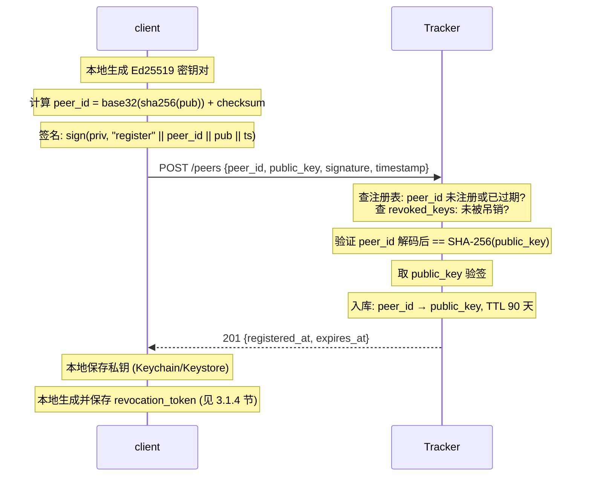

register 不需要 nonce，因为这是客户端**第一次**联系 Tracker，Tracker 对客户端一无所知，没有先验可以发 nonce。防重放靠 `timestamp` 窗口 + 同 `peer_id` 重复注册幂等返回。

##### `DELETE /peers/{peer_id}` — revoke

私钥泄露时调用，一次性。不携带 session JWT。

| 请求字段 | 类型 | 说明 |
| --- | --- | --- |
| `revocation_token` | string | `sign(private_key, "revoke" \|\| peer_id \|\| timestamp)` 的 base64 |

| 响应 | 说明 |
| --- | --- |
| `204 No Content` | 吊销成功 |

**授权与限制**：验证 token 签名；将 `SHA-256(public_key)` 写入 `revoked_keys`（**永久，无 TTL**），删除注册记录，记录 `revoked_at`。实现**可以**尽力通知 Punch Server 清除该 peer 的 Binding，但该通知失败**不得**影响吊销生效（见 3.1.4 节）。此后一切 `iat <= revoked_at` 的票据**必须**拒绝（见 3.1.4 节）。被吊销 `peer_id` **永久不得**再次注册。

**交互流程**：

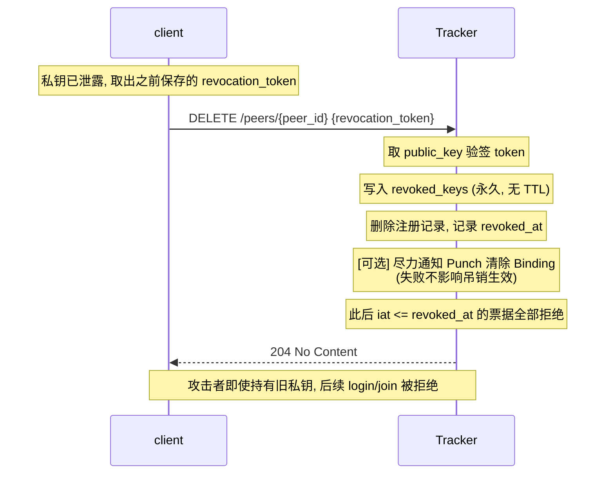

revoke 不需要 nonce——`revocation_token` 是在 `register` 时就用私钥签好的静态声明（`sign(priv, "revoke" || peer_id || timestamp)`），一次签好后离线保存，泄露时提交即可。`timestamp` 在 token 生成时固定，Tracker 校验的是 token 签名而非时间窗口。

##### `POST /sessions` — login

会话级认证。不携带 session JWT。

挑战交互为两段式：

**第一步：获取挑战**

```
GET /sessions/challenge?peer_id=<peer_id>
```

| 响应字段 | 类型 | 说明 |
| --- | --- | --- |
| `nonce` | string | Tracker 下发的一次性随机数（建议 32 字节 hex） |
| `expires_at` | int64 | nonce 过期时间（建议 60 秒） |

**第二步：提交签名**

| 请求字段 | 类型 | 说明 |
| --- | --- | --- |
| `peer_id` | string | 客户端身份 |
| `nonce` | string | 第一步获取的 nonce |
| `signature` | string | `sign(private_key, "login" \|\| peer_id \|\| nonce \|\| timestamp)` 的 base64 |
| `timestamp` | int64 | 请求发起时间戳 |

| 响应字段 | 类型 | 说明 |
| --- | --- | --- |
| `session_jwt` | string | Tracker API 会话 JWT（`scope=query,announce`，`sub=peer_id`） |
| `punch_jwt` | string | 面向 Punch Server 的 punch JWT（`scope=punch`，`aud=punch_id`） |
| `punch_server` | string | 分配的 Punch Server 地址（`host:port`） |
| `punch_public_key` | string | 该 Punch Server 的 Ed25519 公钥 base64（32 字节解码后），客户端验证 Punch 服务器身份用 |
| `stun_servers` | string[] | STUN 服务器列表（`stun:host:port`） |
| `turn_servers` | object[] | TURN 服务器列表，每项含 `url`、`region`、`expires_at` |
| `session_expires_at` | int64 | session JWT 过期时间 |

**授权与限制**：验证签名；nonce 一次性消费；`peer_id` 未被吊销且 `iat > revoked_at`；同时刷新 register TTL。

**交互流程**：

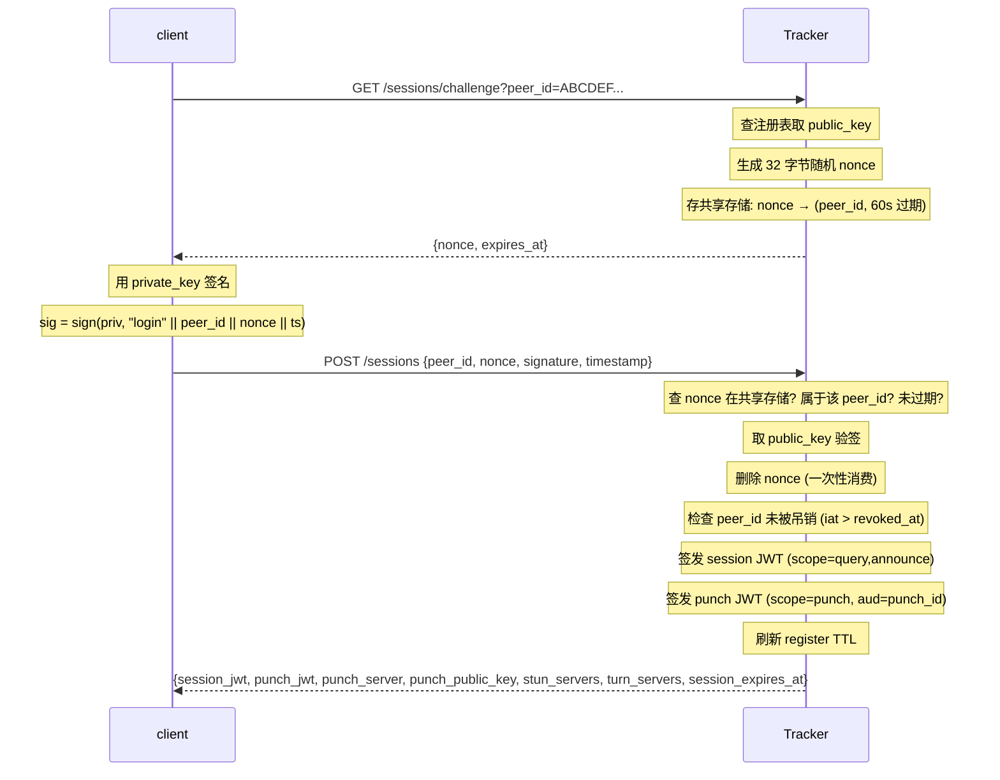

**为什么两步**：Tracker 要让客户端证明"持有 peer_id 对应的私钥"，但签名内容必须包含 Tracker 下发的随机数，否则签名可被重放。第一步取随机数，第二步签随机数。攻击者即使截获完整的 `{nonce, signature}` 也无法重放——nonce 用一次就删。

**为什么 nonce 由 Tracker 生成**：如果客户端自己生成 nonce 再签，Tracker 没有记录"这个 nonce 用过"，攻击者可以重放整个 `{nonce, signature}`。Tracker 必须自己生成 nonce 并追踪是否已消费。

**为什么还要签 timestamp**：nonce 已防重放，`timestamp` 是额外保险——即使 nonce 机制出 bug，timestamp 超出窗口（±60 秒）的请求也被拒。同时 timestamp 让客户端的签名带时间戳，防止 token 被长期保存后跨场景复用。

##### `PUT /peers/{peer_id}/resources` — announce

登记或撤下自己持有的资源。携带 session JWT。

| 请求字段 | 类型 | 说明 |
| --- | --- | --- |
| `add` | string[] | 要登记的 `info_hash` 列表（`sha256:<hex>`） |
| `del` | string[] | 要撤下的 `info_hash` 列表 |
| `complete` | string[] | 标记为完整持有的 `info_hash` 子集（用于粗粒度候选筛选） |
| `ttl` | int32 | 期望过期时间（秒），服务端裁剪到最大值 |

| 响应字段 | 类型 | 说明 |
| --- | --- | --- |
| `expires_at` | int64 | 服务端裁剪后的过期时间 |

**授权与限制**：session `announce`；同一 peer/file 覆盖更新；限制 TTL 上限、批量大小、资源数和调用频率。

**交互流程**：

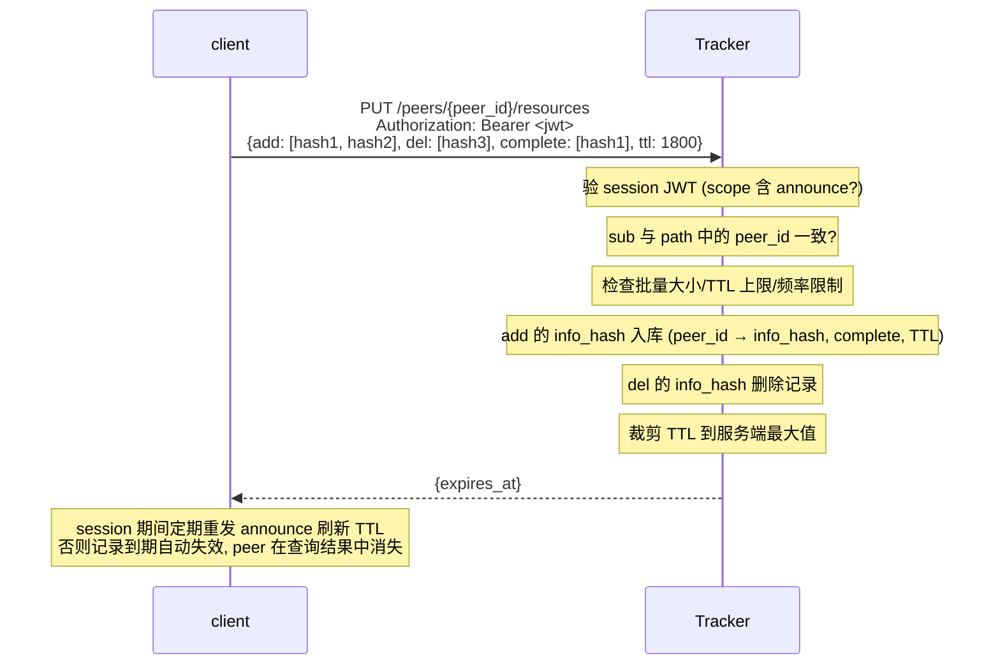

`add` 和 `del` 在一次请求里可以同时出现——先处理 `del` 再处理 `add`，避免"先 add 再 del 同一个"导致记录丢失。`complete` 是 `add` 子集的标记，不单独维护——只对 `add` 列表里的 info_hash 生效。

##### `GET /resources/{info_hash}/peers` — query

查询持有某资源的候选 Peer。携带 session JWT。

| 请求参数 | 位置 | 说明 |
| --- | --- | --- |
| `info_hash` | path | `sha256:<hex>` 格式 |
| `limit` | query | 候选数量上限（默认 10，服务端可裁剪） |
| `cursor` | query | 分页游标（首次请求不传） |

| 响应字段 | 类型 | 说明 |
| --- | --- | --- |
| `peers` | object[] | 候选列表，每项见下表 |
| `next_cursor` | string? | 下一页游标，无更多数据时为 null |

每个候选 peer 对象：

| 字段 | 类型 | 说明 |
| --- | --- | --- |
| `peer_id` | string | 候选身份 |
| `public_key` | string | Ed25519 公钥 base64 |
| `punch_server` | string | 该 peer 所在 Punch Server 地址（Tracker 实时读取） |
| `punch_public_key` | string | 该 Punch Server 的 Ed25519 公钥 base64（32 字节解码后），客户端验证其服务器身份用 |
| `connect_jwt` | string | 一次连接所需的 connect JWT（`scope=connect`，`sub`、`target_peer_id`、`info_hash`、`connection_id` 绑定） |

**授权与限制**：session `query`；限流、防枚举、不得返回 candidates 的公网地址或候选地址；候选数上限防放大——返回 N 个候选即 N 次签名，故 `limit` 不宜取大值（默认 10）。

**交互流程**：

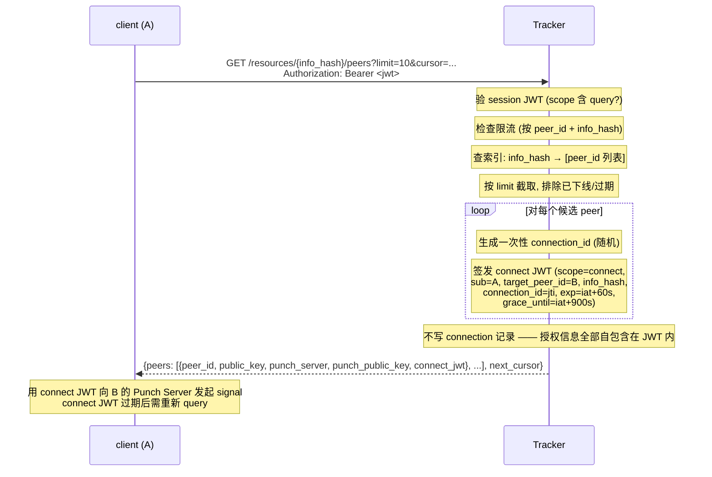

**为什么 Tracker 签发 connect JWT 而不是直接返回 B 的地址**：Tracker 只做发现和授权，不做转发。A 拿到 connect JWT 后直接联系 B 所在的 Punch Server，Punch B 验 JWT 后才转发信令。这样 Tracker 不在数据路径上，也不持有 A/B 的网络地址。

**为什么 connection_id = JWT 的 jti**：`jti`（JWT ID）是 JWT 规范里的一次性标识，Punch B 消费这个 jti 后就不再接受同一 jti 的请求——天然防重放。

**为什么 Tracker 不再记录 connection_id**：授权所需的全部信息（`sub`、`target_peer_id`、`info_hash`、`connection_id`）都已签进 JWT，Tracker 只需验签即可完成 `relay_credentials` 授权。保留一份短命记录既带来写放大（一次 `query` 返回 N 个候选就要写 N 条），又要求多实例间共享它（见 7.1 节），还引入了"记录 TTL 与 ICE 超时谁先到期"的时序耦合——relay 回退发生在 ICE 超时之后，任何以"连接建立超时"为 TTL 的记录都在那一刻已过期。去掉记录后，一次性消费语义仍由 Punch Server 侧的 `jti` 记录保证：**Punch 管 jti，Tracker 管签名与授权**。

##### `POST /connections/relay` — relay_credentials

请求 TURN 中继凭据。携带 session JWT。

| 请求字段 | 类型 | 说明 |
| --- | --- | --- |
| `connect_jwt` | string | query 返回的 connect JWT 本体（完整序列化字符串） |

| 响应字段 | 类型 | 说明 |
| --- | --- | --- |
| `turn_username` | string | 短期 TURN REST 用户名 |
| `turn_password` | string | 短期 TURN REST 密码（HMAC） |
| `turn_servers` | string[] | TURN 服务器列表 |
| `expires_at` | int64 | 凭据过期时间 |

**授权与限制**：仅连接双方；校验 connect JWT 本体（签名有效、`sub` 或 `target_peer_id` 之一 == 请求方身份、`info_hash` 未封禁、`now <= grace_until`——**不检查** `exp`，理由见 3.4.1 节），并检查配额。Tracker **可以**对 `(connection_id, 用途)` 做一次性消费记录，以防宽限窗内反复取凭据。

**交互流程**：

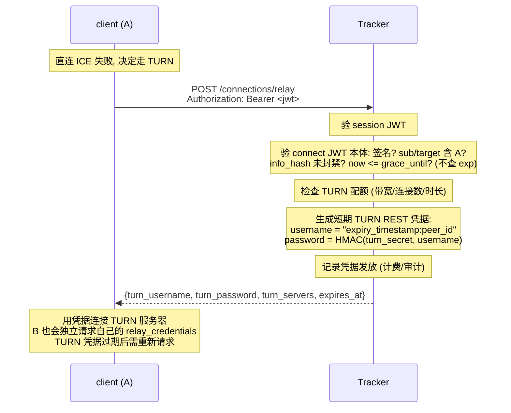

**为什么 A 和 B 各自请求**：TURN REST 凭据是 per-peer 的——用户名里编码了 peer_id，TURN 服务器按 peer_id 计费和限流。A 和 B 拿到的是各自的凭据，不是共享的。

**为什么不查记录而验 JWT 本体**：relay 回退发生在 ICE 超时之后，此时任何以"连接建立超时"为 TTL 的记录都已过期——依赖记录会让回退在最需要它的场景（对称 NAT / CGNAT 打洞失败）失效。connect JWT 本身已是不可伪造的授权凭据，验签 + 校验 `sub` / `target_peer_id` / `info_hash` / `grace_until` 即可确定"请求方曾被授权连接这个资源"，无需任何服务端状态。

#### 7.2.2 Punch RPC 接口

Punch Server 上的接口走加密认证信道（非 REST），以 RPC 风格的接口名 + 消息体交互。

##### `punch.join`

建立 Binding。一步完成，无 challenge 前置。

| 请求字段 | 类型 | 说明 |
| --- | --- | --- |
| `punch_jwt` | string | 来自 login 的 punch JWT（`scope=punch`，含一次性 `jti`） |
| `public_key` | string | Ed25519 公钥的 base64 编码（32 字节解码后），由请求方自带 |
| `signature` | string | `sign(private_key, "join" \|\| punch_jwt_raw \|\| timestamp)` 的 base64，其中 `punch_jwt_raw` 是 punch JWT 的完整序列化字符串 |
| `timestamp` | int64 | 请求时间戳 |

| 响应字段 | 类型 | 说明 |
| --- | --- | --- |
| `binding_id` | string | Binding 唯一标识 |
| `binding_key` | string | 会话级对称密钥（HMAC 用） |
| `expires_at` | int64 | Binding 过期时间 |

**授权与限制**：JWT + 持钥证明；punch JWT 的 `jti` 一次性消费（Punch Server 维护已消费 `jti` 记录，覆盖 punch JWT `exp` 两倍时长）；`peer_id` 未被吊销（`iat > revoked_at`），该状态来自 Tracker 的查询或本地缓存，**查询失败时不得放行**（fail-closed，见 3.1.4 节）；新 binding 替换旧 binding。客户端重连或 binding 过期时需重新 `login` 获取新 punch JWT。

**交互流程**：

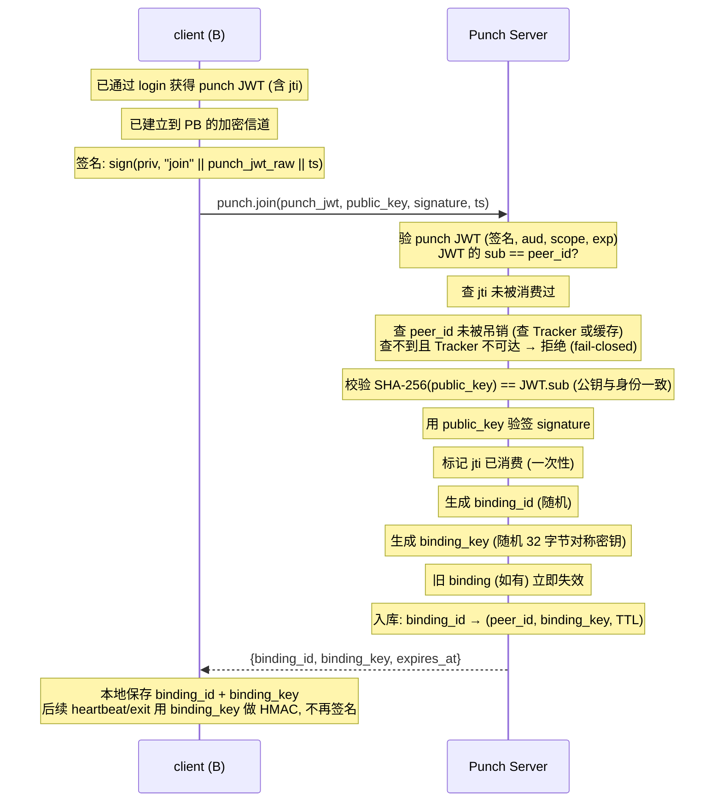

**为什么 join 不需要 challenge**：防重放靠 punch JWT 的一次性 `jti`——首次 join 消费 `jti`，重放同 `jti` 的请求被拒。客户端重连时重新 login 拿新 punch JWT（新 `jti`），不需要在 Punch Server 侧维护 nonce 内存表。`timestamp` 仍纳入签名以约束签名时效。相比 challenge 两步方案，少一次往返，Punch Server 状态更少。

**为什么 join 也要签名**：Punch Server 是独立服务，对客户端**零先验**。punch JWT 证明 Tracker 授权了这次接入，但 JWT 可能被偷。签名证明"持有 peer_id 对应的私钥"，把"JWT 持有者"和"私钥持有者"绑定。

**为什么 join 后改用 HMAC**：join 时已经用非对称签名建立了 binding_key，后续 heartbeat 每隔几秒发一次（维持 NAT 映射），用对称 HMAC 比 Ed25519 签名快 10-50 倍，UDP 包也更小。binding_key 只在加密信道内传输，泄露面小。

##### `punch.heartbeat`

刷新 Binding 与 NAT 映射。

| 请求字段 | 类型 | 说明 |
| --- | --- | --- |
| `binding_id` | string | Binding 标识 |
| `seq` | uint64 | 递增序列号 |
| `timestamp` | int64 | 请求时间戳 |
| `mac` | string | `HMAC-SHA-256(binding_key, binding_id \|\| seq \|\| timestamp \|\| transport_generation)` 的 hex |

| 响应字段 | 类型 | 说明 |
| --- | --- | --- |
| `expires_at` | int64 | 刷新后的过期时间 |

**授权与限制**：有效 binding；校验 MAC、时钟窗口（±60s）和序列窗口（允许有限乱序）。

**交互流程**：

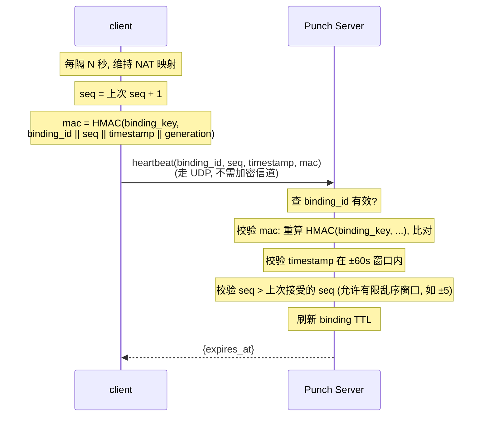

**为什么用 HMAC 不用 JWT**：heartbeat 每隔几秒发一次（保活 + 刷新 NAT），用 JWT 每次验签成本高。HMAC 是对称运算，快 10-50 倍。binding_key 在 join 时通过加密信道下发，只有客户端和 Punch Server 持有。

**为什么走 UDP**：heartbeat 的目的是刷新 NAT 映射（让路由器保持端口转发），UDP 天然适合——不需要 TCP 的握手开销。UDP 不加密但 MAC 已防篡改和防重放。

**为什么有 transport_generation**：ICE restart（网络切换）时 candidate 地址会变，generation 递增。MAC 覆盖 generation，防止旧 generation 的 heartbeat 被用来维持已失效的 NAT 映射。

##### `punch.exit`

主动下线。

| 请求字段 | 类型 | 说明 |
| --- | --- | --- |
| `binding_id` | string | Binding 标识 |
| `seq` | uint64 | 序列号 |
| `mac` | string | 同 heartbeat 的 MAC 算法 |

**授权与限制**：有效 binding；校验 MAC 与序列号；成功后 binding 立即失效。

**交互流程**：

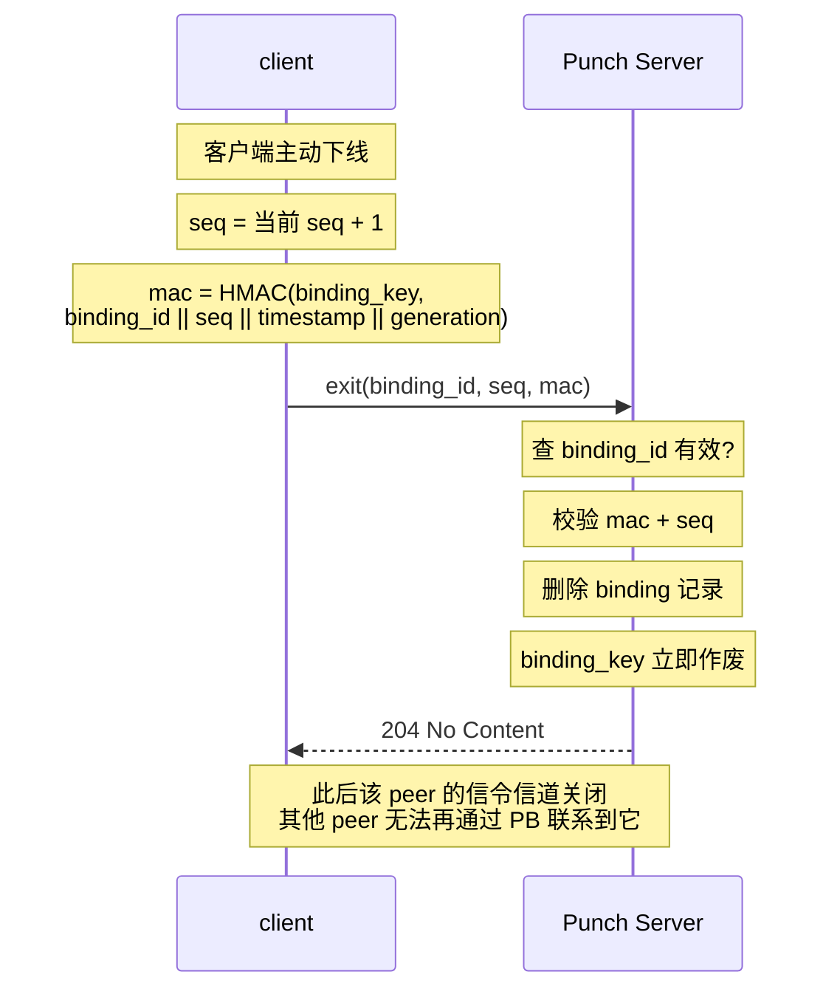

**为什么 exit 复用 heartbeat 的 MAC 机制**：客户端已经持有 binding_key，不需要新凭据。exit 和 heartbeat 用同样的 MAC 算法，Punch Server 用同样的校验逻辑，代码路径统一。

**为什么不先 announce(del) 再 exit**：客户端下线时**应当**先通过 `announce` 的 `del` 撤下自己的全部资源（让 Tracker 停止把该 peer 作为查询候选返回），再 `exit` Punch Server。如果只 exit 不 del，Tracker 的资源索引要等 TTL 过期才消失，期间其他 peer query 到该 peer 后发起连接会失败。

##### `punch.signal`

信令交换。`type` 决定消息体的字段集。

| 请求字段 | 类型 | 说明 |
| --- | --- | --- |
| `type` | enum | `offer` / `answer` / `candidate` / `cancel` |
| `connection_id` | string | 来自 connect JWT 的 `jti` |
| `connect_jwt` | string? | `type=offer` 时**必须**携带；其余类型不重复验证 |
| `sdp` | string? | `type=offer` / `answer` 时携带 SDP |
| `candidate` | string? | `type=candidate` 时携带 ICE candidate 字符串 |
| `signal_key` | string? | 断线重连时携带，用于恢复信令信道 |

| 响应字段 | 类型 | 说明 |
| --- | --- | --- |
| `signal_key` | string? | **仅 `type=offer` 的首个响应**携带，后续消息不重复 |
| `ok` | bool | 转发确认 |
| `error` | string? | 错误码（如 `peer_offline`、`rate_limited`、`invalid_jwt`） |

**授权与限制**：offer 验证 connect JWT（`aud`、`scope`、`sub`、`target_peer_id`、`info_hash`、`connection_id`、`exp`，以及 `iat > revoked_at`——这一项使残留 Binding 也无法接受新连接，见 3.1.4 节；吊销状态来自 Tracker 查询或本地缓存，查询失败时**不得**放行）；answer/candidate/cancel 仅接受已登记连接的双方；SDP 对 Punch Server 不透明；A 断线重连凭 `connection_id` + `signal_key` 恢复。

**交互流程（offer — A 发起连接）**：

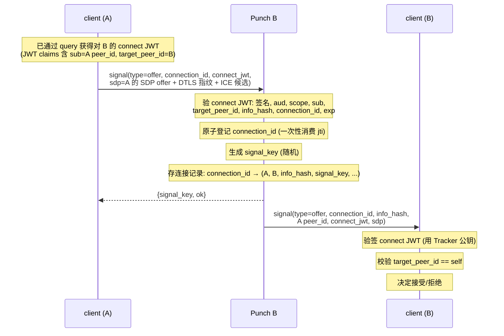

**交互流程（answer — B 应答）**：

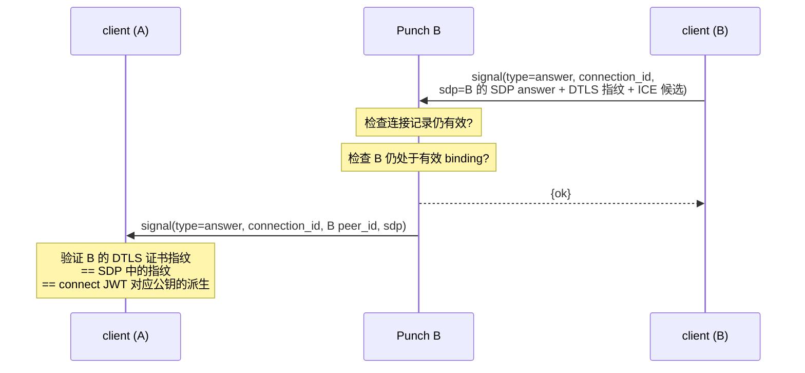

**交互流程（candidate — trickle ICE）**：

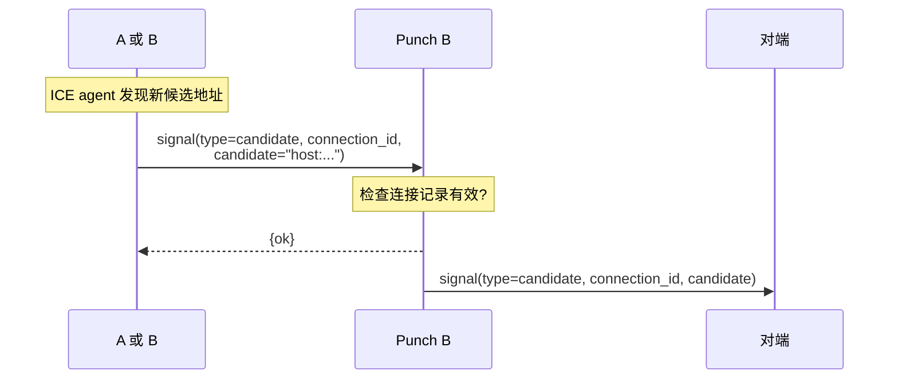

**交互流程（cancel — 取消连接）**：

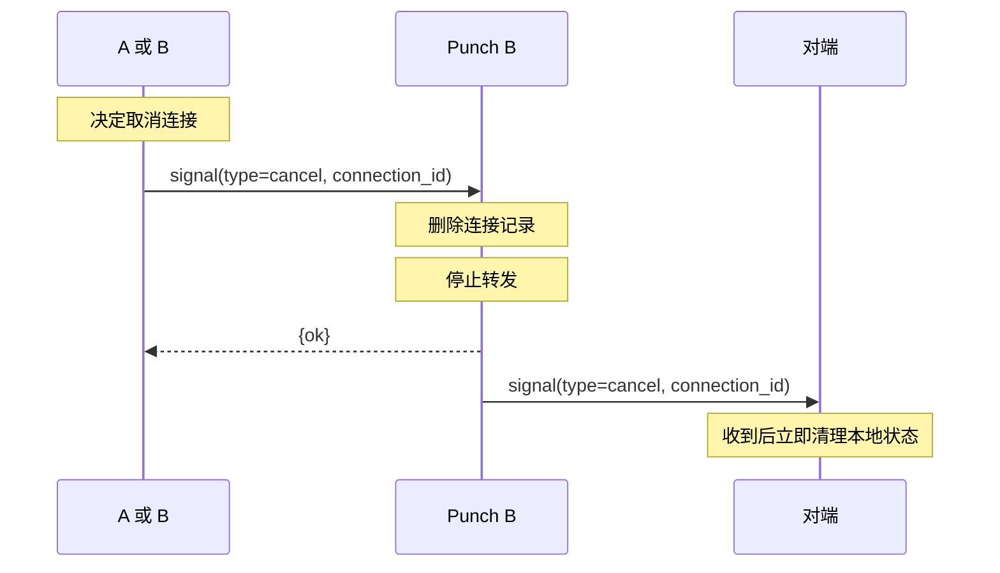

**交互流程（断线重连）**：

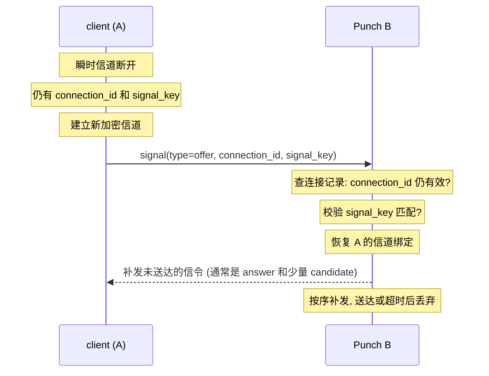

**为什么 offer 要带 connect JWT 而 answer 不用**：offer 是连接的**第一次**消息，Punch B 必须验证 A 有权发起连接（connect JWT 由 Tracker 签发，绑定 A/B/info_hash/connection_id）。一旦 connection_id 被原子登记（jti 一次性消费），后续 answer/candidate/cancel 只需凭 `connection_id` 匹配已登记的连接——信道即凭据。

**为什么 signal_key 只在 offer 响应里下发一次**：signal_key 是对称密钥，用于断线重连时恢复信道。它在加密信道内传输，不暴露给网络。后续消息不再重复发送 signal_key，减少泄露面。

### 7.3 客户端函数面

#### 7.3.1 Tracker 通信接口

客户端对 Tracker 的通信面只有**请求**与**响应**两类，没有 Relay——Tracker 不向客户端推送消息，两者之间也不维护常驻信道；`register` 与 `revoke` 是一次性的身份管理请求，不携带 session JWT；`login` 是会话级认证请求；其余请求均携带 session JWT，在有效期内按需调用。接口与 7.2.1 节的 REST API 一一对应。

| 函数 | 方向 | 对应 REST | 说明 |
| --- | --- | --- | --- |
| `SendRegisterReq` / `OnRegisterRsp` | client ↔ Tracker | `POST /peers` | 首次启动或密钥轮换时调用，一次性 |
| `SendRevokeReq` / `OnRevokeRsp` | client → Tracker | `DELETE /peers/{peer_id}` | 私钥泄露时提交 revocation token，一次性 |
| `SendLoginChallengeReq` / `OnLoginChallengeRsp` | client ↔ Tracker | `GET /sessions/challenge` | 获取登录挑战 nonce |
| `SendLoginReq` / `OnLoginRsp` | client ↔ Tracker | `POST /sessions` | 提交签名，rsp 含 session JWT、punch JWT、Punch Server 分配（地址与公钥）与 STUN/TURN 配置 |
| `SendAnnounceReq` / `OnAnnounceRsp` | client ↔ Tracker | `PUT /peers/{peer_id}/resources` | `add` / `del` 批量登记与撤下资源 |
| `SendQueryReq` / `OnQueryRsp` | client ↔ Tracker | `GET /resources/{info_hash}/peers` | rsp 含候选 Peer 的 `peer_id`、公钥、Punch 地址与公钥及 connect JWT |
| `SendRelayCredentialsReq` / `OnRelayCredentialsRsp` | client ↔ Tracker | `POST /connections/relay` | 请求体携带 connect JWT 本体；rsp 仅含请求方自身的 relay 凭据 |

#### 7.3.2 Punch 通信接口

客户端对 Punch Server 的通信面分为三类：**请求**（客户端发起，必有配对响应）、**响应**（对某个在途请求的确认或错误）、**Relay**（Punch Server 转发来的对端信令，客户端没有对应在途请求）。A / B 是运行时角色，不是两套接口——同一个 client 既维护到自己 Punch Server 的常驻信道（对应 B 角色），也在发起连接时临时连接目标 Punch Server（对应 A 角色）。表中以 A（发起方）、B（提供方）、PA / PB（各自与目标的 Punch Server）标注方向。

| 函数 | 方向 | 说明 |
| --- | --- | --- |
| `SendJoinReq` / `OnJoinRsp` | A ↔ PA；B ↔ PB | `punch.join`；rsp 含 `binding_id`、`binding_key` |
| `SendExitReq` / `OnExitRsp` | A ↔ PA；B ↔ PB | `punch.exit` |
| `SendHeartbeatReq` / `OnHeartbeatRsp` | A ↔ PA；B ↔ PB | `punch.heartbeat`；rsp 含刷新后的过期时间 |
| `SendSignalReq(offer)` | A → PB | 首个请求建立瞬时信令信道；承载 SDP offer；rsp 含 `signal_key` |
| `SendSignalReq(answer)` | B → PB | 走 B 的常驻信道；承载 SDP answer |
| `SendSignalReq(candidate)` | A 或 B → PB | trickle ICE 候选（含 relay 回退阶段） |
| `SendSignalReq(cancel)` | A 或 B → PB | 对端会收到 Relay 的 `cancel` |
| `OnSignalRsp(type)` | PB → A 或 B | 任何 `signal` 请求的确认或错误（如转发成功、记录失效、对端不可达） |
| `OnSignalRelay(offer)` | PB → B | 转发的 offer，走 B 的常驻信道 |
| `OnSignalRelay(answer)` | PB → A | 转发的 answer，走 A 的瞬时信道 |
| `OnSignalRelay(candidate)` | PB → A 或 B | 转发的对端候选地址 |
| `OnSignalRelay(cancel)` | PB → A 或 B | 非发送方收到后立即清理本地状态 |

断线重连（`connection_id` + `signal_key`）属于信道层，不占业务函数；重连后补发的未送达信令同样从 `OnSignalRelay` 进入。`Relay` 在此指"经 Punch Server 转发的信令"，与 TURN / Relay Server 无关。

#### 7.3.3 Peer 通信接口

Peer 之间的消息是对称、单向的，没有控制面那种请求-响应对，因此函数不带 Req / Rsp 后缀。`bitfield`、`have`、`request`、`reject`、`pause`、`resume`、`request_proof`、`proof`、`chunk_nack`、`piece_done`、`cancel`、`request_info`、`info` 走控制通道（reliable + ordered），`chunk` 走数据通道（unreliable + unordered，`maxRetransmits = 0`，1024 字节/条，block 的最后一个 chunk **可以**捎带该 block 的 Merkle 证明）；连接建立与断线重连属信道层（ICE / DTLS），不占业务函数。

| 函数 | 方向 | 说明 |
| --- | --- | --- |
| `SendBitfield` / `OnBitfield` | A ↔ B | 连接建立后一次性交换；为空可跳过 |
| `SendRequestInfo` / `OnRequestInfo` | 缺 info 方 → 对端 | magnet 模式：bitfield 交换前发起 |
| `SendInfo` / `OnInfo` | 对端 → 请求方 | info 字节串；接收方校验 `SHA-256 == info_hash` 后使用 |
| `SendHave` / `OnHave` | A ↔ B | 每验证一个 block 广播给所有已连接 Peer |
| `SendRequest` / `OnRequest` | 下载方 → 上传方 | 在途窗口内；响应为 `chunk` 流或 `reject` |
| `SendChunk` / `OnChunk` | 上传方 → 下载方 | 数据本体，1024 字节/条，走数据通道；末尾 chunk 可捎带证明作冗余，但不得作为唯一来源 |
| `SendChunkNack` / `OnChunkNack` | 下载方 → 上传方 | 批量请求重传缺失 chunk |
| `SendPieceDone` / `OnPieceDone` | 下载方 → 上传方 | 收齐确认，上传方释放缓冲 |
| `SendReject` / `OnReject` | 上传方 → 下载方 | 按单个请求粒度拒绝，含 `retry_after`；下载方必须遵守退避或转投 |
| `SendPause` / `OnPause` | 上传方 → 下载方 | 连接粒度停止服务，含 `retry_after`；下载方必须停发新 request |
| `SendResume` / `OnResume` | 上传方 → 下载方 | 恢复服务；连接建立时默认 resume |
| `SendRequestProof` / `OnRequestProof` | 下载方 → 上传方 | 取连续 block 区间的证明；走控制通道，不受 `pause` 限制 |
| `SendProof` / `OnProof` | 上传方 → 下载方 | 叶子哈希段 + 上层节点，先于（或平行于）数据发出；校验见 4.2.1 节 |
| `SendCancel` / `OnCancel` | 下载方 → 上传方 | 撤销在途请求（endgame / 转投） |

## 8. 安全性考量

本设计的信任模型：Tracker 是控制面的信任根（身份注册、授权签发、资源索引），其被攻破或作恶的破坏半径限于审查、拒绝服务与元数据监视——数据面内容的完整性由 Merkle 证明校验（锚点为 `info_hash` 自校验的 `info.root`）与端到端 DTLS 独立保证，与 Tracker 的可信度解耦（见 4.2 节与 5.2 节）。客户端与 Punch Server 对 Tracker 的访问只依赖其逻辑服务地址与签名公钥，不依赖任何具体实例。

### 8.1 控制面

- 没有面向 Punch 的 `punch JWT`：攻击者可伪造任意 `peer_id` 绑定到 Punch Server，造成身份冒充、在线表污染或会话劫持。
- 没有 `heartbeat` 的 MAC、序列号和过期管理：攻击者可伪造或重放保活包，使虚假 Binding 长期存在，或干扰真实 Peer 的可达性。
- 没有针对 B 的短期 `connect` JWT：任何人只要知道 Punch B 地址，就能要求它向 B 投递信令；Punch Server 会被用于骚扰、扫描、反射流量或对大量 Peer 发起连接请求。
- 只靠 `scope=connect`、却不校验 `aud` 与 `target_peer_id`：一张泄露票据可被拿去联系其他 Punch 节点或其他 Peer，权限范围过大。
- 没有 `exp`、`jti`：截获的连接请求可在很久以后无限重放。
- 没有独立的 TURN 授权与配额：攻击者可把 TURN 当开放代理消耗带宽，造成高额成本与滥用风险。
- 没有密钥吊销机制：私钥泄露后，攻击者持有私钥即可持续 login 获取新 session JWT，短 `exp` 只能限制单次会话窗口，无法阻止冒充。本设计通过 revocation token（第 3.1.4 节）解决——吊销是**永久**状态：写入 `revoked_keys`、删除注册记录、记录 `revoked_at`，此后该 `peer_id` 的 login / join 全部拒绝（判据统一为 `iat > revoked_at`），攻击者即使持有私钥也无法重新获取 session JWT。要求客户端妥善备份 token；token 丢失时无法吊销，因此实现**可以**额外提供 Tracker 签发的 revoke credential 作为备份路径。

### 8.2 数据面

- 没有端到端身份认证和加密：即便 Punch/TURN 已正确鉴权，仍无法阻止恶意中继或网络路径窥探、篡改、冒充对端。
- 恶意 Peer 投递损坏数据：Merkle 证明校验使污染数据无法进入 verified 状态，攻击者最多浪费下载方带宽，并累积失败计数直至被断开与拒绝重连。
- 恶意 Peer 提供无效证明：证明的正确性判据是"重建结果 == `info.root`"，root 由 `info_hash` 自校验——攻击者无法伪造一条能通过校验的假证明，只能让下载方白跑一遍，同样计入失败。
- 伪造 info 或谎报 bitfield：`SHA-256(info) == info_hash` 自校验使伪造 info 无法通过；谎报 bitfield 的 Peer 要么交不出数据计入失败，要么伪造数据过不了证明校验。
- CDN 内容不可信：CDN 作为虚拟 Peer 的数据同样经证明校验，CDN 被入侵或内容被篡改不产生额外信任面。前提是"数据承诺"来源可用——`leaf_hashes` / `proof_list` 提供的叶子哈希列表由客户端本地重建 root 后采信（5.1 节），因此 CDN 即使同时提供数据与"证明"也无法骗过校验；两者都不可用时 CDN 数据**不得**进入 verified 状态。
- 上传方给数据却不给证明：数据 unreliable、证明 reliable，若证明可被拒绝，下载方拿到整块却无法校验，只能超时转投——一种低成本的带宽浪费攻击。规范以"服务了数据后**不得**拒绝提供其证明"与"`request_proof` 不受 `pause` 限制"两条约束堵住（4.5 节），对应 BEP 52 对 `hash request` 的同一规定。
- 恶意巨型种子文件：解析前检查总长与 `length` 上限（第 5.2 节），防御 DoS。

## 9. 参考资料

以下参考均为 informative（参考性），本设计与其中协议不互通。

- RFC 2119 / RFC 8174：规范性关键词。
- RFC 8445：ICE（Interactive Connectivity Establishment）。
- RFC 5766：TURN（Traversal Using Relays around NAT）。
- RFC 7675：ICE 连接保活与 consent。
- RFC 8831 / RFC 8832：WebRTC Data Channels 与 DCEP。
- RFC 8785：JSON Canonicalization Scheme（本设计比较后未采用）。
- RFC 6962：Certificate Transparency —— Merkle 树的形态、域分隔前缀与奇数层提升规则（4.2.1 节采纳其构造，不采用其证明编码）。
- BEP 3（BitTorrent 协议）、BEP 6（fast extension）、BEP 19（web seeding）、BEP 52（v2）：消息语义与元数据形态的主要参考。
- coturn TURN REST API（static-auth-secret 短期凭据）。
